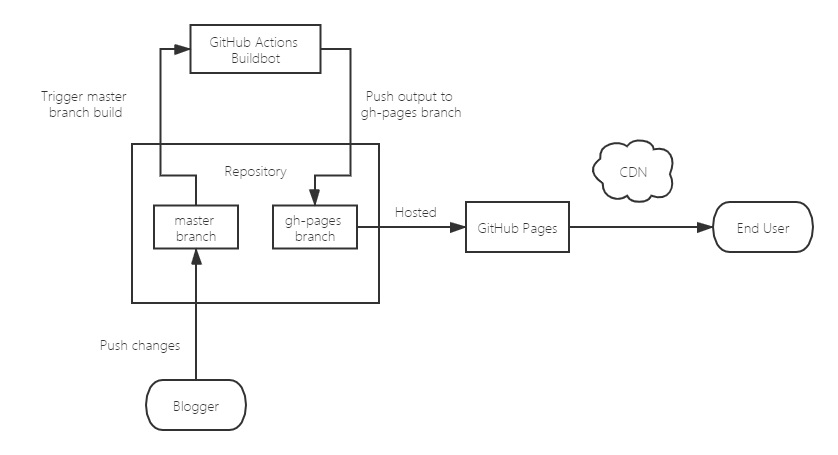

<p align="center">
  <h1 align="center">Hello World!</h1>
</p>
<p align="center">
  <a href="https://saberjs.org/">
    
  </a>
  <a href="https://www.travis-ci.com/h404bi/www.h404bi.com">
    
  </a>
  <a href="https://www.h404bi.com">
    
  </a>
  <a href="https://code.visualstudio.com">
    
  </a>
  <a href="https://github.com/h404bi/www.h404bi.com">
    
  </a>
  <a href="https://github.com/h404bi/www.h404bi.com">
    
  </a>
</p>

<p align="center">
  This repository contains all the source code of h404bi's personal <a href="https://www.h404bi.com">website</a>.<br/>
  <sub>You can also see the auto-generated deployable files at <a href="https://github.com/h404bi/www.h404bi.com/tree/gh-pages"><code>gh-pages</code></a> branch.</sub>
</p>

## Architecture



## Playground

**Prerequisites:**  
Git, Nodejs, Yarn

### Clone the source:

``` sh
$ git clone https://github.com/h404bi/www.h404bi.com.git
$ cd www.h404bi.com
```

### Run and play:

``` sh
# Bootstrap, install dependencies
$ yarn bootstrap
# Start dev server
$ yarn dev
# Listening 127.0.0.1:3000
```

## License

Content @ [Chawye Hsu](https://www.h404bi.com), All Rights Reserved.
