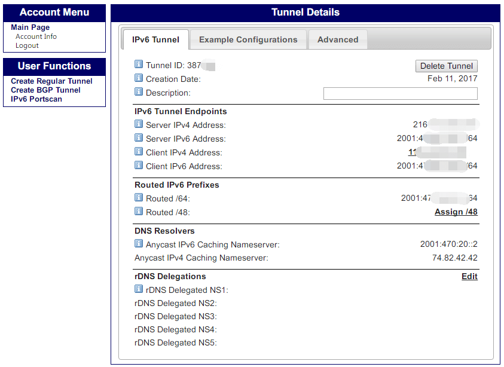

之前还在大学时，除开锐捷，由于内网的原因，要玩 IPv6 的话就只能用六飞之类的工具。工作后，发现在住所报装的网络，居然给（是的，长这么大第一次在家用宽带得到）了公网 IP。刚开始时想过利用这个公网 IP 来搞个 Minecraft“家庭服”，对小伙伴们开放。但折腾下来发现上传太可怜了，还是不祸害小伙伴了。

就这样过了许久。突然心血来潮，看能不能试试在校时想搞的 he.net 6in4 隧道，发现配置下来还挺简单的。因为这个玩法其实已经有好多人实践过了[^1][^2][^3][^4]，我也就是搜搜折腾记录下。

## 创建 HE 6in4 隧道

支持 IPv6 以及 6in4 的 Openwrt 路由器是前提了。到 [https://tunnelbroker.net/](https://tunnelbroker.net/) 注册一个新帐号。登录后，点击左侧的 User Functions 中的 Create Regular Tunnel 创建新的隧道。

在 Ipv4 Endpoint 中填入路由器 wan 口的公网 IP。然后在下面的 Available Tunnel Servers 选择一个 he 的 6in4 隧道服务器。列表有显示地区和服务器的 IPv4，可选择一个连接速度较快延迟较低的（提示：并不是亚洲区就最快，建议本机 ping 一下看看，我选的就不是亚洲区）。最后点击 Create Tunnel 便创建了一个 6in4 隧道。

其中 IPv6 Tunnel Endpoints 部分是这个 6in4 隧道两端的 IPv4 和 IPv6 地址。Server 是 HE 的隧道服务器，Client 是我们的路由器或计算机。下方的 Routed IPv6 Prefixes 是该隧道可用于分配的 IPv6 地址段，可为路由器背后的内网机器都分配上唯一的 IPv6 地址。

  <adsbygoogle ad-layout="in-article" ad-format="fluid" ad-slot="8422573867"/>

## Openwrt 配置 HE 6in4

在 Luci 界面中，依次点击“网络”-“接口”-“添加新接口”创建新接口。接口名称随意，这里为方便辨认以 HENET 为例，协议选择 IPv6-in-IPv4 (RFC4213)，然后提交。

接着“基本配置”。“本地IPv4地址”留空，“远程IPv4地址”填写上面创建的 HE 6in4 隧道中的“Server IPv4 Address”，“本地IPv6地址”填写隧道中的“Client IPv6 Address”，“IPv6 routed prefix”填写隧道中的“Routed /64”。

然后勾选“启用HE.net动态终端更新”，填写相应的“隧道ID”，“HE.net用户ID”，“HE.net密码”。这里注意“HE.net用户ID”提示说“这是32 byte hex编码的用户ID，不是登录名”，也即不是注册时的用户名，这个值可以点击左侧的 Main Page 中找到。

接着在防火墙设置页中，确保防火墙区域跟 wan 的相同。最后保存应用，到此配置就完成了。剩下的就是测试了。看下网卡能否正常获得 IPv6 地址，到 [http://ipv6-test.com/](http://ipv6-test.com/) 检查一下 IPv6 状态。访问 [https://ipv6.google.com/](https://ipv6.google.com/) 试试，可用！聊胜于无，哈~

[^1]: [使用HE的6in4隧道来访问ipv6](https://ekszz.com/blog/?p=20)
[^2]: [Openwrt配置6in4访问ipv6网络](https://ekszz.com/blog/?p=115)
[^3]: [OpenWrt配置he.net的6in4隧道访问IPv6](http://demon.tw/hardware/openwrt-6in-ipv6.html)
[^4]: [在OpenWRT上配置HE IPv6隧道的正确姿势](https://typeblog.net/tunnelbroker-on-openwrt/)

