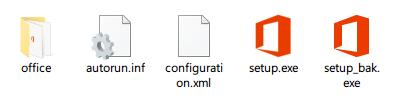

作为宇宙第一 IDE Visual Studio 的兄弟，宇宙第一办公套件 Office 在 Windows
系统下更加常见。新安装的系统，即使刚开始不愿安装，等到要查看编辑 docx pptx
文档时，还是会乖乖就擒。只是没想到，Office 2016 这个 2.41GB 的安装镜像，
居然是一个 Click-to-Run。

> FILE cn_office_professional_plus_2016_x86_x64_dvd_6969182.iso  
> SHA1 277926A41B472EE38CA0B36ED8F2696356DCC98F  
> SIZE 2.41GB

点一下，就全自动帮你把 Office 全家桶完整安装上了，不需要你做任何的下一步设置，
也不给你做任何的安装设置。

对于日常只使用 Word、Excel、Powerpoint，最多再加一个 Outlook 的人来讲，
全家桶的 Access、Onedrive for Business、Publisher、Skype 等必然是多余的，
装上了基本不会用到。如果你想干掉这些没用处的部分应用，又或者像我一样，
此前已经知道过 Click-to-Run 的厉害，但新装系统后手抖直接点下了镜像的
setup.exe 的话，那就来与我一起“卸了又装”。

## 卸载已安装的 Office

在[Office 官方文档库]里，选择第 2 种方法：

> Option 2 - Completely uninstall Office 2016 with the easy fix tool

下载 easy fix tool: `o15-ctrremove.diagcab`，双击执行一路到底后重启计算机。

## 重新自定义安装 Office

**第一步：** 解压安装镜像。因为待会要替换文件，直接挂载 iso 的话无法进行替换。

**第二步：** 下载 [Office 2016 Deployment Tool]。执行后会解压出两个文件，
一个是 `configuration.xml`，另一个是 `setup.exe`。将两个文件覆盖到刚刚解压的
镜像文件夹内（也可以改名备份原来的 setup.exe）。

**第三步：** 修改 Deployment Tool 配置。编辑 `configuration.xml` 文件，
设定安装版本，更新频道，**排除不想安装的应用**。以下是我的配置文件，
安装 64 位专业中文版（对应 `cn_office_professional_plus`），仅保留了 Word、
Excel、Powerpoint 以及 Outlook，其它全部排除。如果想把 Outlook 也排除的话，
可以在此配置基础上再加上 `<ExcludeApp ID="Outlook" />` 即可。
具体配置说明可以看配置文件里面的注释。

<!-- Gist -->

**第四步：** 载入配置文件进行自定义安装。在镜像解压目录下，按住
<kbd>Shift</kbd> + 鼠标右键，在当前目录打开命令行。键入
`./setup.exe /configure configuration.xml` 并执行。

UAC 弹窗确认后开始自动安装。不过这次可以很明显的看到不再是全家桶都给你安装上了。

## 结尾小 Tips

1. Outlook 添加两步验证的帐号时，要使用 App Password 而不是帐号主密码。
2. Outlook 默认下很奇怪的是，启动后你点最小化，它实际上并不会最小化到托盘，
在任务栏上还是会有 Outlook 的图标。而如果你选择点关闭，则整个 Outlook 都会关掉。
通常比较多的可能是误点关了 Outlook，而退出后的 Outlook 是不接收邮件的。
这时可以使用一个[小插件]实现 Outlook 点关闭时最小化到托盘，解决这个问题。

完整的 gist 归档：[gist.github.com/h404bi/62f65347d5784b37c8535aa371c59720]

[Office 官方文档库]: https://support.office.com/en-us/article/9dd49b83-264a-477a-8fcc-2fdf5dbf61d8
[Office 2016 Deployment Tool]: https://www.microsoft.com/en-us/download/details.aspx?id=49117
[小插件]: https://jocent.me/2017/06/20/outlook-close-minimize.html
[gist.github.com/h404bi/62f65347d5784b37c8535aa371c59720]: https://gist.github.com/h404bi/62f65347d5784b37c8535aa371c59720

<!-- Vue -->

