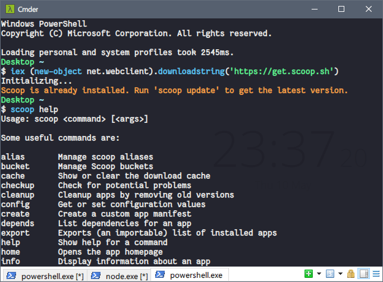
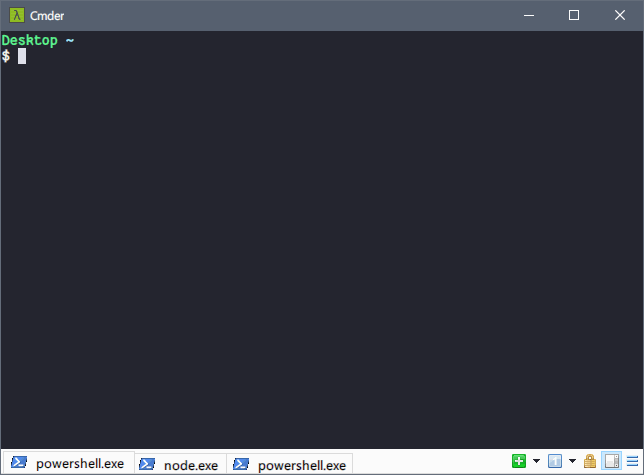
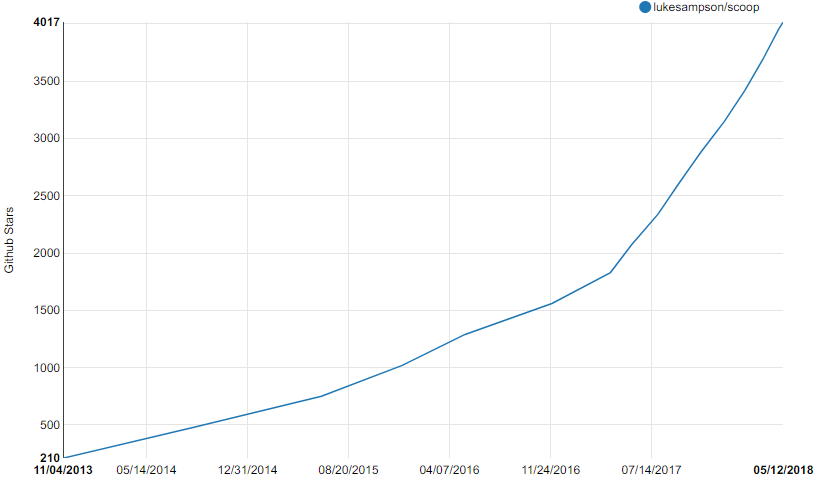

在 2015 年的《[用 Scoop 改善 Windows Powershell](/blog/2015/08/use-scoop-to-enhance-windows-powershell)》博文中，
我曾经介绍过这个令我眼前一亮的 Windows 软件包管理器。
那是我刚开始使用上 Scoop 的时候，回看过去对它的介绍，
也确像是一见钟情后的入坑纪实。简单，直接。

那会我很快适应了 Scoop，并一直使用至今。经过这两年多的使用，
我渐渐地更加依赖 Scoop 来管理一些软件。在我日常的 Windows 使用中，
它带给我的便利，已不再仅仅是那时所言的“改善 Windows Powershell”。
其实感觉就现在的 Scoop 而言，它确实还是挺小众的。只是最近我发现
有些人通过搜索引擎浏览了我的那篇旧文，我觉得那篇文章太旧且简单了。
于是挖下这么一个坑，写下这篇新文章更新下对 Scoop 的介绍与体会。

<hr>

## 软件包管理器

> [https://scoop.sh/](https://scoop.sh/)

这是 Scoop 的官网首页。网站正中央醒目的 Slogan 已表明了它的定位，
一个 Windows 下的命令行式的（软件）安装工具。

> A command-line installer for Windows

虽然 Scoop 的作者在项目的 GitHub Wiki 中谈到，
Scoop 只是一个安装工具（installer），不应该被称为包管理器（package manager）。
但是对于使用者而言，它与我们一般认为的软件包管理工具其实很是相似。

作为对比，我列举一下常见的不同系统下类似的工具：

| 系统 | 工具 | 范例 | 备注 |
|------|------|------|------|
| Arch Linux | Pacman | pacman -S pyenv | Built-in |
| CentOS/RHEL | yum | yum install python-wheel | Built-in |
| Debian/Ubuntu | apt/apt-get | apt install python3 | Built-in |
| Fedora | dnf | dnf install python-pip | Built-in |
| macOS | Homebrew | brew install python | 3rd-party |
| openSUSE | zypper | zypper install python3-pip | Built-in |
| Windows | Chocolatey | choco install docker | 3rd-party |

这些工具的一个重要的特征是在终端下以**命令行**形式工作。
所以很多情况下，安装一个软件时你不再需要使用浏览器打开
[https://www.python.org/](https://www.python.org/downloads/)
网页，找到并下载安装包，双击安装程序。而是直接一句命令，然后等完成就行了。


{.right}

作为一个以桌面环境专长的系统，Windows 自然不会有像 Arch Linux 亦或者 Debian
等以命令行环境起家的 Linux 系统那样，内置有这样的工具。不过，苹果家的 macOS
这个无论命令行环境还是桌面环境都好使的系统，却也没类似的工具。
但在用户社区的不断发展下，[Homebrew](https://brew.sh/) 这个神器从社区中诞生，
弥补了 macOS 的一大“缺陷”。那句充满自信的 Slogan，足以体现出 Homebrew
的地位。（更别提以~~小号~~ Linuxbrew 身份扩散至 Linux 社区……会不会有
Windowsbrew/Winbrew 呢哈哈……）

> Homebrew: The **missing** package manager for macOS

回到 Windows 这边厢。用户的需求与社区的发展必然也会催生类似的工具。
在产生的这为数不多的几种工具中，巧克力（Chocolatey）是目前最为出名，
相信也是用户数最为多的一个。从最初的开源项目，到现在的独立公司商业项目
（仍开源），收获近 6000 个软件包与近 3 亿次包安装次数（2018 年 5 月官网数据）。
甚至在 Windows 10 系统开始集成的官方“包管理器”（这里打引号是因为我觉得
它已经超出了包管理器的基本范畴，更像是一个聚合物，一个超集）—— [OneGet] 都
提供了对 Chocolatey 源的支持，你可以直接用 OneGet 安装 Chocolatey 的软件包。

但就像 NPM 之后的 Yarn 那样，轮子还是会有人重新造的。在 Chocolatey 之后的
2013 年，[lukesampson](https://github.com/lukesampson) 开发了 Scoop。
我了解过但没并用过 Chocolatey，所以接下来我只能根据我对 Chocolatey 的短浅认识，
来说一说我为什么一开始就选择用上了 Scoop。

<div class="gad">
  <adsbygoogle ad-layout="in-article" ad-format="fluid" ad-slot="8422573867"/>
</div>

## Why Scoop

<p style="position:relative;padding-bottom:56.25%;">
<iframe style="position:absolute;width:100%;height:100%" 
src="https://www.youtube.com/embed/a85QLUJ0Wbs" frameborder="0" 
allow="autoplay; encrypted-media" allowfullscreen></iframe></p>

上方是 Scoop 刚发布时（我想也是唯一）的介绍视频，观看要能访问 Youtube。

如上文说的我对 Scoop 的“一见钟情”，这里我换个表达：第一感觉。很多情况下
第一感觉确实很能影响一些事情，不管人还是物。就从上面的视频里拿出来说一下，
Scoop 的安装说明真的很直截了当，有且仅有那一行命令，没有任何选择余地。
就像 Homebrew 那样，将命令粘贴至终端回车就好了。我也看过 Chocolatey 的
安装说明[^1]，虽然也提供了无脑一行命令的安装方式，但看到 More Install Options
我还是会研究一番看看怎么安装最优最合适，然后就不由自主地陷进去了。
这里有个趣闻，Chocolatey 的创始人曾经在 Scoop 的 GitHub 项目下提 issue[^2]
询问 Scoop 能否整合 Chocolatey，并表示 Scoop 非常**利落**。

上面是第一感观。第二个是 Scoop 跟 Chocolatey 对于管理员权限安装的部分
的不同处理方式，直接让我倾向于先入手了 Scoop。Chocolatey 的安装脚本默认要求
管理员权限安装，同时非管理员安装默认路径是 `C:\ProgramData\chocoportable`，
这对于非高权限用户来说不太友好（比如没有管理员权限的工作机安装会比较折腾），
而 Scoop 默认仅需普通用户权限，安装路径是 `%USERPROFILE%\scoop` 则显得比较清新，
不过这都是可以根据需求修改的了。


{.left}

关于 Chocolatey 默认管理员权限安装的原因，应该是比较明显的：
Chocolatey 需要能处理安装更多的软件包，比如 Flash Player Plugin，
VirtualBox，以及 Windows 的各种 KB 补丁。因为默认管理员，
所以很多只能以管理员身份安装到高权限目录的软件 Chocolatey 就能比较方便地处理了。
而 Scoop 的处理方式则反过来，默认普通用户权限。软件包能限当前用户，
不全局安装的就不全局安装。如果需要全局安装则自行利用 `-g` 参数提升为管理员权限安装。

这极大地方便了低权限用户，同时用户目录安装不污染系统目录，比较讨喜“绿色用户”。
我觉得 Chocolatey 才更像是命令行式软件安装工具（Installer），通过命令行来执行
各种软件的安装。而 Scoop 在我看来优先解压包体的理念，反而更有 Homebrew
那种装瓶（bottle）与倾倒（poured）的感觉[^3]。

第三个就是软件包（package）及其仓库。二者在这一部分的不同设计，
让我决定了先放弃尝试 Chocolatey。首先是关于软件包的定义，Chocolatey 用的是
`.ps1` 脚本和 `.nuspec` 定义文件（xml），Scoop 用的是 json。乍一看你便会像
Chocolatey 作者对 Scoop 的评价那样：

> **ferventcoder**: this is super neat...

另一个是 Scoop 有用户软件包仓库的概念，官方仓库里没有你想用的软件包，
又或者你想自定义一些软件包，那么可以自己建一个仓库，存放自己的软件包定义文件。
在实际的使用体验上，相信也会更加喜欢 Scoop 这样的设计，它更接近于 Homebrew：
软件包 manifest -> Formula，仓库 bucket -> tap。

剩下的可以再通过上面的视频介绍自行体会一下。总的来说，
Chocolatey 能更加全面地包办绝大多数的软件安装，适应重度需求；
而 Scoop 则更加简单利落，容易自定义软件包，适应中低需求。而我恰是后者，
对于像 VirtualBox、Docker for Windows 这些需要高权限的软件还是会用安装包
在用户界面下自定义安装。更特殊的用户倒是更可以将 Chocolatey 和 Scoop 结合使用。

## How Scoop

Scoop 需要 PowerShell 3 以上进行安装使用。最新的 Windows 10 系统已经是
PowerShell 5 了所以可以直接使用安装命令。Windows 7 的话默认是 PowerShell 2，
可以根据微软的文档[^4]升级到 PowerShell 5，或者可以安装使用新的 [PowerShell Core]，
即 PowerShell 6。然后两句命令很快就安装好了：

```powershell
# 先设置 PowerShell 允许执行未签名脚本
set-executionpolicy remotesigned -s currentuser
# 下载 Scoop 安装脚本进行安装
iex (new-object net.webclient).downloadstring('https://get.scoop.sh')
```



由于 Scoop 的安装脚本托管在 GitHub 的仓库里，所以对于无法正常访问 GitHub
的用户来说，安装的时候可能需要加一层全局代理后再进行安装[^5]。

执行 `scoop help` 看一下子命令就能快速上手，用过 Homebrew 的话应该更不在话下。
比如 `scoop info <app>` 是最近新集成的子命令[^6]，在安装软件前可以对包体有个了解。

```powershell
$ scoop info grep
Name:      grep
Version:   2.5.4
Website:   http://gnuwin32.sourceforge.net/packages/grep.htm
License:   GPL-2.0 (https://spdx.org/licenses/GPL-2.0.html)
Manifest:
  C:\Users\hanabi\scoop\apps\scoop\current\lib\..\bucket\grep.json
Installed: No
Binaries:
  bin\grep.exe
```

然后就能像上面的视频里那样安装和使用软件包了。这里说一下，
由于 Scoop 的设计以及其基于GitHub 的特性，一些软件包相信你会必定安装的：

> scoop install git 7zip

就像介绍视频里说的那样，Scoop 默认不会污染用户的 PATH 环境变量（除非软件包
有修改环境变量的定义），而是使用垫片（shims）来进行统一管理调用执行文件。


{.right}

当你通过 `scoop search <app>` 搜不到需要的软件包的时候，这时候便是你开始
进阶使用 Scoop 的时候了。Scoop 管存放软件包描述文件的地方叫做桶（Bucket），
桶里面就是一个个 json 格式的软件包描述文件，Scoop 的默认桶的名字就叫 [bucket]。
当找不到需要的软件的时候，最直接的自然是可以向仓库提交你想要的软件包的描述文件，
比如像这些这样：[scoop/pull/2151](https://github.com/lukesampson/scoop/pull/2151)、
[scoop/pull/2143](https://github.com/lukesampson/scoop/pull/2143)、
[scoop/pull/2002](https://github.com/lukesampson/scoop/pull/2002)。

不过在你进一步使用 Scoop 时，除了会遇到找不到软件包而可能会频繁提交描述文件之外，
你还可能会对已有的某些软件包，有一些自己的“差异需求”，比如“不想某软件包设置
某个环境变量”、或者“修改某个软件包的安装行为”。这时候，一个更好的办法：**自定义桶**。

桶其实就像 Homebrew 的 Tap，关于桶的详细概念可以查看一下 Scoop 的 Wiki 页[^7]。
通过自定义桶就可以将自己的“使用习惯”收纳起来，而不用频繁向 Scoop 的 main bucket
提交请求（Scoop 维护者一般也不能马上处理你的请求）。我维护着自己的桶，
所以自己的软件包需求随时可以进行自定义：

> [https://github.com/chawyehsu/dorado](https://github.com/chawyehsu/dorado)

比如 Scoop 的 main bucket 中的 nvm-windows 使用时会有 UAC 提权，我自己编译了一份
没有 UAC 弹窗的 nvm-windows，放到了自己的桶里面。目前 dorado 这个 bucket，在目前
已知在维护的 [Scoop bucket] 中已经是综合评分比较高的一个 bucket 了，所以欢迎 Star、
Fork 以及订阅使用。另外要说一下的是 Scoop 的自定义桶不一定要求存放到 GitHub 的公开
仓库上的，所以完全可以在本地创建一个 git 仓库，做成一个不公开的私有桶，用于存放一些
不宜公开的软件包。



Scoop 还自带一个切换软件包版本的功能，可以让你在不同的软件包版本中进行自由切换。
这个我想在上文的视频中你已经有看到了。这在你同时需要几个版本的软件包时会比较有用，
比如 Python2 和 Python3（虽然 Python2 即将退役）。

```powershell
$ scoop install python27 python
$ python --version        # -> Python 3.6.x

$ scoop reset python27
$ python --version        # -> Python 2.7.x

$ scoop reset python
$ python --version        # -> Python 3.6.x
```

我看到网络上有不少使用 Chocolatey 的人吐槽其下载安装软件包的时候奇慢，有的
甚至因此而放弃继续使用 Chocolatey。通过 Scoop 本地自定义桶的话，拉取软件包
描述文件的时候可以说是毫秒级的。然后还可以在描述文件里，自行修改软件包的
下载链接，比如改成适合自己的 CDN 下载或者是私有软件源等。这样安装软件时会
特别快速。这一切都得益于 Scoop 比 Chocolatey 更利落的软件包描述文件设计
以及桶设计，用户自定义软件包所需的学习成本更低。

<div class="gad">
  <adsbygoogle ad-layout="in-article" ad-format="fluid" ad-slot="1370220280"/>
</div>

## 但 Scoop 还有问题

Scoop 是一个从个人项目开始，发展到现在由社区维护的开源项目。Scoop 不像 Chocolatey
那样已经成立公司，并推出商业版，它仍然是一个“个人”项目，只是目前靠着社区在维护。
所以它的活跃度与维护情况肯定是不如 Chocolatey 的，一些缺点还是有的。
这里我只说一下几点我认为的 Scoop 应该要在后续发展中优先考虑处理的问题。

### 没有稳定版

目前的 Scoop 本身的核心功能是“滚动更新”的，它没有版本号的概念，
不像 Chocolatey[^8] 和 Homebrew[^9] 那样有 Releases，
所以也就没有所谓稳定版本。只要 Scoop 的 GitHub 仓库有新的 commits，
用户通过 `scoop update` 命令就会拉取所有的 commits 更新。


{.right}

如此的滚动更新，对于一个社区维护的开源软件来说，会很容易产生问题。
没有 tags，没有 releases，如果维护者或者贡献者在 commit 时不小心手抖
加入或者修改了一些代码，造成了 BUG，并且 commit 的人还并不知情。
这个 BUG 将很快地传到最终用户那里，因为用户更新时是立刻拉取最新 commit 的。
这时遇到问题的用户，需要到 GitHub 上开 issue 反馈，或者开 Pull-Request。
但有权限处理合并的协作者也就那么几位（创始人 Luke 不怎么活跃了[^10]，
除了目前的 commit 数最多那位主要维护者外，其他几位协作者也是最近才加的），
按以往的情况来看多数得半天以上时间才完成修复。

1. [更新历史新功能导致 BUG 大概半天之后修复](https://github.com/lukesampson/scoop/issues/2144)  
2. [重构核心函数导致 BUG 大概半天之后修复](https://github.com/lukesampson/scoop/issues/2243)
3. [重构核心函数导致 BUG 数天尚未完成修复](https://github.com/lukesampson/scoop/issues/2239)

Scoop 目前的设计是很直接的，核心功能组件跟 main bucket 揉在一起，一更新 bucket
核心文件跟着更新。如果我没记错的话，早期的 Homebrew 也是这样的设计，而 Scoop
又是借鉴了 Homebrew 的设计。如今的 Homebrew 已经拆分为 brew 和 homebrew-core 两部分，
前者是 brew 的核心功能代码，后者是默认的软件包仓库。brew 核心会打 release 包，
用户在更新时会检查 brew 有没有新版本，如果没有则不会更新 brew 本身，只更新软件包仓库。

```bash
$ brew -v
Homebrew 1.6.3
Homebrew/homebrew-core (git revision bdb1ff; last commit 2018-05-03)
```

我觉得 brew 这个新设计 Scoop 是需要跟进的。将 main bucket 从 Scoop 主仓库中分离出来，
Scoop 本身的仓库维护其核心功能代码，并打上 tags，发布 release 包，
给 Scoop 一个版本号，定期更新稳定可用的版本。所有用户安装 Scoop 时，默认使用最新的
稳定版，并克隆 main bucket 的最新 commit。而 Scoop 主仓库继续向前推进开发，
开发者及少数激进的用户可以通过修改 `channel` 设置使用 nightly/insider 版本的 Scoop。
这样即时新功能出 BUG 了，也不会马上传播到所有的 Scoop 用户，因为大部分用户用着
稳定版。

### 仍需优化的核心功能

在我使用的这近三年里，除了一次默认安装路径的变动之外[^11]，在使用上其实并没有
感受到 Scoop 有什么巨大的改动。它并没有什么 Breaking Changes，一直是平平淡淡
稳定前进，加加子命令完善体验之类的，虽然 Scoop 似乎是被越来越多人发现，
当然越来越多人用意味着会有越来越多的新需求和新问题（所以我才觉得得有稳定版本）。



不过没有大改动的同时，Scoop 的一些存在设计不足的核心功能，也照样是稳稳
定定没有优化。这里我就说几个在使用 Scoop 时一定会遇到的情况：

第一个。`scoop install <app>` 安装软件包的命令。当你使用的自定义 bucket 当中有
跟主 bucket 有相同名字的软件包描述文件的时候，直接执行 `scoop install <app>`
默认会选择主 bucket 中的描述文件进行安装。你不得不卸载软件包并重新执行
`scoop install <bucket>/<app>` 进行安装。对于有自定义桶的用户来说，
估计会经常遇到，因为一时疏忽就忘了 bucket 名字直接敲软件名字安装了。
关于这个点，最近才有人开了个新 issue 讨论这个问题[^12]。

第二个。`scoop uninstall <app>` 卸载软件包的命令。当你卸载一个软件包，
而恰好这个软件正在运行的时候。目前的卸载指令会让这个软件包处于一个
“没卸载干净”的状态[^13]。只要执行卸载，便会马上清理相关的 shims，shortcuts，
然后删到一些不能删的文件了，就会提示文件正在使用不能清理。更好的设计
应该是先检查文件是否有占用，是否有服务在运行。没有才开始清理 shims 等。
这样软件包可以要么是完全卸载干净了、要么还是正常的安装状态。

第三个。`scoop cleanup <app>` 清理旧版本软件包的命令。这个命令有跟上面的
卸载命令有类似的问题。用 Scoop 更新了软件后，当前运行着的其实还是旧版本的软件，
然后清理会把旧版本的清理掉，这时会跟卸载命令一样，删到一些不能删的文件了，
才会提示文件正在使用不能清理，让旧版本软件变成一个“没卸载干净又不再可用”的状态。

第四个。`scoop update <app>` 更新软件包的命令。Scoop 的更新命令的逻辑是这样的，
当执行更新一个软件包时，它会先卸载旧的版本（清理 shims、shortcuts 等），给新
版本预创建目录，然后下载新版本并检查安装包的哈希值。当哈希值正确时，才进行安装。
那如果下载软件包过程中断线了呢？或者哈希值不对呢？于是问题来了，恰恰是这样的逻辑，
会导致一个大概会是你用 Scoop 时最经常遇到的问题——软件实际上没更新成功，
但 Scoop 却给你显示软件已经是最新的版本，并且旧版本无法使用[^14][^15]。
你不得不执行 uninstall 命令并重新安装软件，或者 reset 命令重置软件。这个问题
我相信只要是 Scoop 用户，都会经历过。

回头看一下你会发现，我所讲的这几点基本上覆盖了 Scoop 最常用的几个命令：安装、
卸载、更新、清理，这几个都是 Scoop 最最核心的功能。自我开始用 Scoop 到现在，
这几个毛病就一直存在着。所以我才说，Scoop 的一些核心功能仍然存在不足需要改进。
到目前还没有优化，也许是没有很好的解决方案吧。

## 结语

回看全文下来，我觉得文章算了符合了我原本想写成的，以我的角度更新对 Scoop
的介绍与体会的形式。对比、优点、缺点都稍微讲到了，应该不会有强烈的安利感觉。
我看到访问记录有人从搜索引擎搜 Chocolatey 和 Scoop 的对比，找到了我原来那篇文章。
想必也是想做个选择。其实如果你是偏重度的用户，想尽量多的软件可以用命令行管理，
又不在乎我前文说的 Chocolatey 的软件包描述文件相对复杂等缺点的话，其实可以去
试试使用 Chocolatey。而如果你没那么强烈的需求，只是像我一样有一点点
“绿色软件洁癖”，同时想用命令行管理部分软件包，并且以此构建一个相对轻量的
命令行环境的话，不妨可以尝试一下 PowerShell + Scoop + Cmder 这套组合。
或者，Chocolatey 和 Scoop 二者一起用也是可以的。


[^1]: [https://chocolatey.org/install#more-install-options]
[^2]: [https://github.com/lukesampson/scoop/issues/2]
[^3]: [https://github.com/Homebrew/brew/blob/master/docs/Bottles.md]
[^4]: [https://docs.microsoft.com/en-us/powershell/scripting/setup/installing-windows-powershell?view=powershell-6#upgrading-existing-windows-powershell]
[^5]: [https://github.com/lukesampson/scoop/issues/2227]
[^6]: [https://github.com/lukesampson/scoop/pull/2165]
[^7]: [https://github.com/lukesampson/scoop/wiki/Buckets]
[^8]: [https://github.com/chocolatey/choco/blob/master/CHANGELOG.md]
[^9]: [https://github.com/Homebrew/brew/releases]
[^10]: [https://github.com/lukesampson/scoop/graphs/contributors]
[^11]: [https://github.com/lukesampson/scoop/blob/master/lib/core.ps1#L1]
[^12]: [https://github.com/lukesampson/scoop/issues/2121]
[^13]: [https://github.com/lukesampson/scoop/issues/488]
[^14]: [https://github.com/lukesampson/scoop/issues/2220]
[^15]: [https://github.com/lukesampson/scoop/issues/2245]

[PowerShell Core]: https://docs.microsoft.com/en-us/powershell/scripting/setup/installing-powershell-core-on-windows?view=powershell-6
[OneGet]: https://github.com/OneGet/oneget
[https://chocolatey.org/install#more-install-options]: https://chocolatey.org/install#more-install-options
[https://github.com/lukesampson/scoop/issues/2]: https://github.com/lukesampson/scoop/issues/2
[https://github.com/Homebrew/brew/blob/master/docs/Bottles.md]: https://github.com/Homebrew/brew/blob/master/docs/Bottles.md
[https://docs.microsoft.com/en-us/powershell/scripting/setup/installing-windows-powershell?view=powershell-6#upgrading-existing-windows-powershell]: https://docs.microsoft.com/en-us/powershell/scripting/setup/installing-windows-powershell?view=powershell-6#upgrading-existing-windows-powershell
[https://github.com/lukesampson/scoop/issues/2227]: https://github.com/lukesampson/scoop/issues/2227
[https://github.com/lukesampson/scoop/pull/2165]: https://github.com/lukesampson/scoop/pull/2165
[https://github.com/lukesampson/scoop/wiki/Buckets]: https://github.com/lukesampson/scoop/wiki/Buckets
[bucket]: https://github.com/lukesampson/scoop/tree/master/bucket
[https://github.com/chocolatey/choco/blob/master/CHANGELOG.md]: https://github.com/chocolatey/choco/blob/master/CHANGELOG.md
[https://github.com/Homebrew/brew/releases]: https://github.com/Homebrew/brew/releases
[https://github.com/lukesampson/scoop/graphs/contributors]: https://github.com/lukesampson/scoop/graphs/contributors
[https://github.com/lukesampson/scoop/blob/master/lib/core.ps1#L1]: https://github.com/lukesampson/scoop/blob/master/lib/core.ps1#L1
[https://github.com/lukesampson/scoop/issues/2121]: https://github.com/lukesampson/scoop/issues/2121
[https://github.com/lukesampson/scoop/issues/488]: https://github.com/lukesampson/scoop/issues/488
[https://github.com/lukesampson/scoop/issues/2220]: https://github.com/lukesampson/scoop/issues/2220
[https://github.com/lukesampson/scoop/issues/2245]: https://github.com/lukesampson/scoop/issues/2245
[Scoop bucket]: https://github.com/rasa/scoop-directory/blob/master/by-score.md
