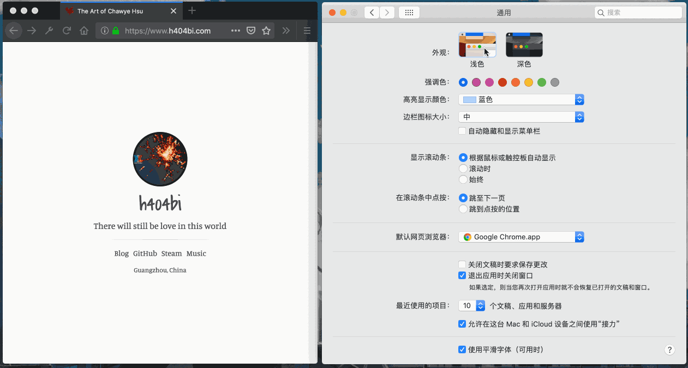

苹果公司的操作系统 macOS 从 10.14 Mojave 版本开始，为用户提供了[深色模式]的可选外
观。用户可以在系统中的通用设置里选择启用深色模式，整个系统的界面会全局变为暗色调。
对于夜间使用场景而言，深色模式的界面可能会显得更加友好，也更能让用户集中注意力。

<!-- more -->


利用苹果公司提供的[接口]，各类原生桌面应用程序都开始陆续支持深色模式，可根据 macOS
用户的系统设置进行换肤，比如 Google Chrome、Microsoft Office 等。

但对于 Web 应用而言，似乎还没有什么讨论。好消息是 CSS 的媒体查询（media queries）
新增加了一个叫做 `prefers-color-scheme` 的媒体特征，开发者可以通过该设置特征，让网
站的配色随着 macOS 系统的界面外观色调改变而改变。

```css
/* 常规浅色模式下的网页背景颜色及文本颜色 */
body {
  background: #fff;
  color: #222;
}

/* 深色模式下的网页背景颜色及文本颜色 */
@media (prefers-color-scheme: dark) {
  body {
    background-color: #222;
    color: #ddd;
  }
}
```

`prefers-color-scheme` 支持三个值，分别是 `no-preference`、`light`、以及 `dark`，
对应是“无指定”、“浅色主题”以及“深色主题”。详情可以查看 [MDN] 说明。

这个还在 CSS 草案阶段的媒体特征[^1]，显然尚未被主流浏览器大规模支持，不过已经开始
受到部分浏览器支持了。可以从 MDN 或者 [Can I Use] 上看到，Firefox 67 以及 Safari
12.1 开始支持该媒体特征。


如果你是 macOS 用户，又正巧使用的是支持该特征的浏览器的话，可以通过切换系统的外观
色调，查看到我的博客配色跟随系统色调的变化。



除了 Firefox 浏览器之外，也可以用 macOS 系统的 Safari 查看到效果。


图中的文章见《[总结下博客最近的调整]》。不过其实 `prefers-color-scheme` 只是帮助做
到随系统自动变化而已，网站的深浅配色系统本身还是要开发者预先设计好。

[^1]: https://drafts.csswg.org/mediaqueries-5/#descdef-media-prefers-color-scheme

[深色模式]: https://www.apple.com/cn/macos/mojave/
[接口]: https://developer.apple.com/documentation/appkit/supporting_dark_mode_in_your_interface
[MDN]: https://developer.mozilla.org/zh-CN/docs/Web/CSS/@media/prefers-color-scheme
[Can I Use]: https://caniuse.com/#search=prefers-color-scheme
[总结下博客最近的调整]: /blog/2019/04/recent-changes-of-my-site
