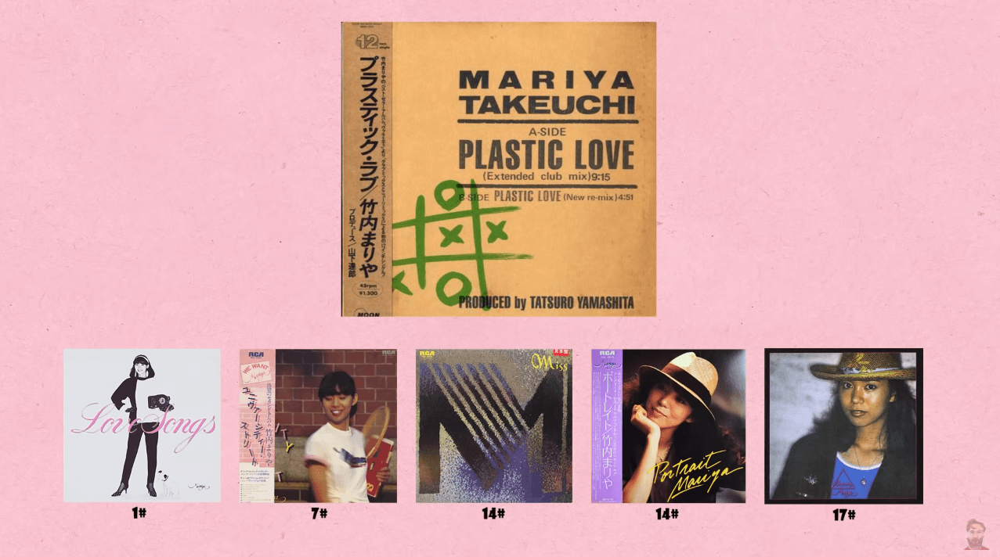
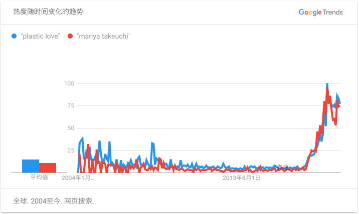
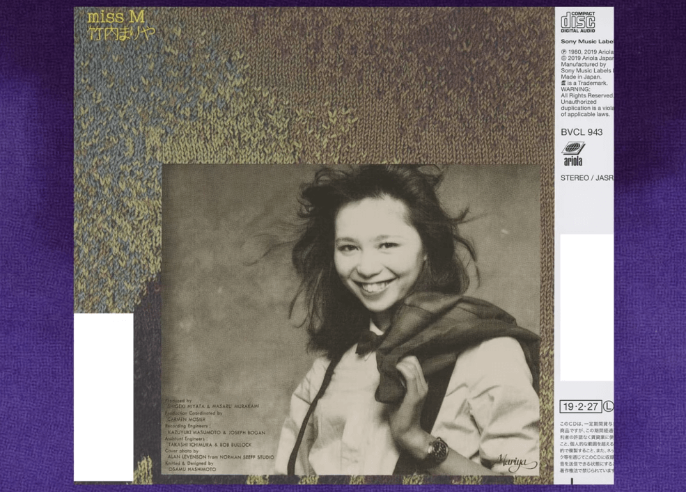

**UPDATE Mar/2021**：得知完整版 MV 已经流出，在文章内更新了完整版 MV，补充了 MV 主
演、导演等 meta 信息，对文稿做了些许排版调整，修复了一些小错误。

---

今天我们来谈谈音乐吧，这是我很喜欢的一个话题。聊聊音乐趣事，当然可能会扯到些扩散话题。

## 旧事物总有一天会重新闯入你的生活，即使那不是你的过去

2019 年 5 月 16 日，<ruby>日本华纳音乐<rt>Warner Music Japan</rt></ruby>在流媒体
网站 YouTube 上传了<ruby>竹内玛莉亚<rt>竹内まりや</rt></ruby>的一首大热单曲《<ruby>
プラスティック<rt>Plastic</rt>・<rt> </rt>ラブ<rt>Love</rt></ruby>》的一支<ruby>先
行版<rt>Short ver.</rt></ruby> MV[^1]。这首在 2018 年引起病毒式传播的歌曲，在发布
的 35 年后，“意外地”拥有了它的官方 MV。

<!-- more -->

<figure data-type="video" class="embed-wrapper embed-aspect-16-9 alignwide">
  <iframe
    src="https://player.bilibili.com/player.html?aid=331023532&bvid=BV1YA411W71o&cid=283214724&page=2&as_wide=1"
    width="800" height="450" allowfullscreen>
  </iframe>
</figure>

2020 年 11 月，这个让不少乐迷们苦等了一年多的完整版 MV，终于随着竹内玛莉亚出道 41
年以来首次发售的影像作品《souvenir the movie 〜MARIYA TAKEUCHI Theater Live〜》一
同“上画”。MV 由[林響太朗]执导，[上杉柊平]及[仁村紗和]分饰男女主演，作成于 2019 年。

---

如果你还未曾对这首极具时代色彩的日本 City Pop 歌曲有所了解的话，别担心，点击播放这
首歌曲，来与我一边感受日本八十年代特有的气息，一边继续慢慢阅读下文。

<figure>
  <iframe
    src="https://music.163.com/outchain/player?type=2&id=659423&auto=0&height=66"
    width="100%" height="auto">
  </iframe>
</figure>

1984 年，结婚两年后的竹内玛莉亚以专辑《Variety》复出，正式完全转型为创作歌手。对于
这位当时还是 29 岁的音乐人而言，这张专辑的推出成为了她的一个重要转折点 ——《Variety》
是竹内玛莉亚的第一张登顶日本公信榜 Oricon 榜的专辑[^2]。

而 Plastic Love，便是这张专辑中的其中一首，也是后来竹内玛莉亚在全球范围内最为知名
的一首歌曲。次年的 3 月 25 日，Extended Club Mix 版本的 Plastic Love 作为一支单曲
发行，一度冲上 Oricon 榜第 86 位。

竹内玛莉亚的许多歌曲都曾被翻唱过，比如陈慧娴的《岁月流声》便是翻唱自她的《Natalie》，
草蜢的《原谅我是我》翻唱自《シングル・アゲイン》。当然这首 Plastic Love 也不例外，
梅艳芳就为此翻唱过两个版本 —— 国语版的《找爱的人》以及粤语版的《寻爱》。由此可窥见
此曲的魅力[^3]。

不过，真正将 Plastic Love 这首歌曲重新带到当下人们的视线中，并引爆传播炸弹的，是
来自 YouTube 上关于这首歌曲的奇妙事件……

  <adsbygoogle ad-layout="in-article" ad-format="fluid" ad-slot="8422573867"/>

## 这就是互联网的迷幻之处，我真的不知道为什么突然就……

2017 年 7 月 5 日，YouTube 上一个名为 Plastic Lover 的不知名帐号，平常地上传了一个
名为「[Mariya Takeuchi 竹内 まりや Plastic Love]」的视频，其中的音频是 Plastic Love
歌曲的 7 分钟饭制加长版本，而提供的画面是一张静止的照片。只是，这张照片并不是所想的
Plastic Love 单曲的封面，而是来自于竹内玛莉亚另一张单曲《Sweetest Music / Morning Glory》
的封面。

**到此，奇妙的故事才刚刚开始。**

一个无人关注、平庸如常的普通帐号，上传了一个有好看封面的音乐分享视频。这本该是一件
普通地不能再普通的事情。但是这一份普通，却似乎是被当时的 YouTube 给看上了。在视频
被上传之后，YouTube 的推荐算法开始将这个视频“有意无意地”推送到了一部分用户的「接下
来播放」列表中，以试探这些用户是否对此感兴趣。

而事实是，确实有一批用户认真的看完了这个视频，同时将 Plastic Love 加入到了他们的
音乐播放列表中。这些用户的反应让 YouTube 推荐算法做出了更进一步的动作 —— 向更多用户
推送这个视频。最终的结果便是，这个由爱好者上传的音乐视频累计获得了 5700+ 万次播放
（截至 2021 年 3 月），并让 Plastic Love 这首歌成为了 2018 年 YouTube 上最流行的歌
曲之一。这首三十多年前的老歌，重新进入了广大互联网居民的讨论圈中。同时带来的，还有
相当一部分人在尝试寻找为什么 YouTube 的推荐算法会有这么一个“癖好”的完美解答，以及
一个对 J-Pop 音乐子类 City Pop 的~~挖坟~~复古热潮。

![▲ YouTube 的算法怎么了 / 图：STEVEM[^7]](../_assets/uploads/2019/05/20190519005.png)

**故事还没结束。**

前面说到，Plastic Lover 上传的饭制视频中，使用的不是原 Plastic Love 单曲的封面，
而是《Sweetest Music / Morning Glory》单曲封面的截图。也许就是这么一个在当时上传者
有意无意做出的变化，让观众觉得这首歌变得更加迷幻。照片中三十多年前竹内玛莉亚那份独特
的韵味，似乎与 Plastic Love 异常地相配（想像在当时只有第 86 位的 Plastic Love 
如果用的是 Sweetest Music 的这张封面，我想一定会更好吧）。越来越多的爱好者基于这
个封面创作出了许多有意思的作品，并在 DeviantArt、Tumblr 等平台上传播了起来。

 上的各种同人作品](../_assets/uploads/2019/05/20190519006.png)

越来越多的相关视频持续被算法推送至更多未曾了解过日本 City Pop 的用户，越来越多的二
次作品诞生以及蔓延开来。 Plastic Love 的<ruby>模因<rt>meme</rt></ruby>[^4]产生了，
并且一发不可收拾。关于 Plastic Love 与竹内玛莉亚的搜索热度持续上升。

可是就在 2018 年的 12 月 20 日，当时就已经突破 2400 万次播放量的「Mariya Takeuchi
竹内 まりや Plastic Love」视频，被 YouTube 以侵权为理由删除了。发起侵权处理请求的，
不是竹内玛莉亚及其唱片公司，却是一位名为 Alan Levenson 的人。其理由是，他拥有视频
中那张照片的版权。

于是，YouTube 上这一份被热捧了 7×2400 多万分钟的塑料爱情，就这样与竹内玛莉亚那一个
迷人的微笑，一同消逝在了 2018 年的圣诞节前夕。

很快，整个互联网记住了 Alan Levenson 这个名字，并且开始不高兴了。人们开始在推特等
社交平台上诅咒 Alan Levenson，查到了 Alan 的邮箱地址并给他发送恶语谩骂邮件，指责他
以 Plastic Love 的名气逐利云云。

后来，Alan 联系上了几位当时给 Plastic Love 做出过热门科普视频的 YouTuber，道出了
关于竹内玛莉亚那张微笑照片背后的往事……

> 这张既没有出现在《Variety》专辑中，也没有出现在 Plastic Love 单曲中的照片，是
> Alan 于 1980 年在洛杉矶，为当时竹内玛莉亚准备发布的《Miss M》专辑拍摄的素材。但
> 是后来这张照片并没有被 RCA（竹内玛莉亚当时的唱片公司）选为专辑封面，RCA 只是将
> Alan 拍摄的其他照片随机地分散在了《Miss M》专辑的 B 面中[^5]。

三十多年后，Alan 通过 YouTube 上 Plastic Love 的病毒性传播才得知了自己当时拍摄的
照片出现在了另一支单曲的封面中。他为自己的作品被上千万的观众所喜爱而感到惊讶的同时，
对 RCA 当时不采用自己的创意作为《Miss M》专辑的封面而感到愤慨。

同时 Alan 认为，华纳音乐（竹内玛莉亚如今的唱片公司）利用 YouTube 上 Plastic Love 
突然火爆的事件，来宣传抬高竹内玛莉亚出道 40 周年纪念专辑的商业行为，没有给他合理的回
馈。在他实在无法联系上当时上传「Mariya Takeuchi 竹内 まりや Plastic Love」视频的
作者 Plastic Lover 商讨相关事情的情况下，只好动用了侵权删除的办法。

视频下架，推荐减少，热度逐渐消退，似乎大家都冷静了许多。网络还是继续地运作着，人们
的生活也依旧进行着，时间也持续地在向未来延伸。

**故事到结尾了，但是我们还是相信未来的。**

4 个月后的 2019 年 4 月份，Plastic Lover 现身了，联系上了包括 Alan 在内的几位事件
参与者。在他们的交谈与努力下，被下架的视频在 2019 年 5 月 14 日，又回到了 YouTube
的推荐流中，人们又能打开观察竹内玛莉亚的微笑了。除了视频封面以及视频描述里增加了关
于照片版权的信息外，其他的一切都还是原来的样子，音频、播放量、评论。

而再往后两天的 5 月 16 日，便是文章开头提到的日本华纳音乐为 Plastic Love 这首三
十多年的老歌，发布了先行版官方 MV 的事件。当然了，商业公司的这种行为必然不会是纯粹
地“意外”与“怀旧”了。不过呢，能够让这些旧时被埋没的美好事物，再次展现给当代的人们以
欣赏与回味，不也是挺好的事情嘛。昭和末平成初的事物，到了令和也是要炒炒真香冷饭。

](../_assets/uploads/2019/05/20190519010.png)

> 连 Plastic Love 这首歌曲都能在 35 年后获得官方 MV，那么相信不管花多少时间，你
> 都可以完成你的目标的！—— @Lumena_tan

## 这份满是既视感的遇见，其实早就在某处埋下了种子

关于 Plastic Love 在 YouTube 上的故事讲完了，但其实，与 Plastic Love 相关的音
乐故事我还想说些什么。以下都是我的个人认识与见解，君如有不苟同之处不妨当个乐子看吧。

其实， Plastic Love 在 YouTube 上突然的火爆，原因并不全是因为所谓的 YouTube 推荐
算法突然的“嗜好”。以 Plastic Love 为主的一大批上世纪 80 年代的日本 City Pop 歌曲
再度受到当代部分人的喜爱追捧，跟近些年来热度不低的蒸汽波 Vaporwave 及其子类的亚文
化有着千丝万缕的关系。只是 YouTube 上的这次事件，让这一趟数十年轮回的复古狂欢，来得
更猛烈持久了些。

<figure>
  <iframe
  src="https://music.163.com/outchain/player?type=2&id=408328190&auto=0&height=66"
  width="100%" height="auto"></iframe>
  <figcaption>▲ TARA - Plastic Love (TARA Bootleg) / 2016 / Future Funk</figcaption>
</figure>

蒸汽波从 2010 年初出现，至今发展不过 10 年，但已经发展出不少的分支子类。其中比较有
名和相对流行的，就是 Future Funk。这个子类的作品的采样更多地取材于上世纪 80、90 年
代的日本 Funk 音乐、City Pop 都市流行乐以及部分欧美同期的歌曲，同时引入了更多的
Disco/House 音乐的元素。这些与原始 Vaporwave 的不同点让这类作品变得更抓耳和更容易
接受。通过“future funk plastic love”作为关键词去搜索引擎里搜索的话，你会发现不少采
样自 Plastic Love 的 Future Funk 作品，有些在很早就出来了。

> 既要怀旧，又要现代。单纯听老歌，不一定能听得进去。而只取抓耳的部分，再加入舞曲节
> 奏搅拌一下，更符合现代年轻人。—— [知乎@金时代]

但其实，一旦突破了这个自我限制去听原曲的话，你会发现一片新的天地。不过我感觉，跟我
同辈的人，不管听蒸汽波也好，听 City Pop 也罢，应该都会有 VICE 的一篇文章里说的一个
情况：我们这一代并没有过在那个时代的生活经历，但是为什么听这些歌时会有一种莫名的怀
旧感？以及会感觉到或向往自己在那个时代生活的样子[^6]。

我想以我对以上疑问的鄙见来结束这篇文章。作为千禧一代的我们，其实从小就受到过 City
Pop 以及其所在年代的其它文化的影响。小时候跟着父母听的港乐，张国荣、梅艳芳，不少歌
曲都有着与东瀛那个年代相似的感觉。以及小时候接触的还是那个年代画风的动画、游戏等，
都给那时年少的我们带来了许多美好的记忆。

进入社会后，却才发现自己的各种不是。纵使物质上逐渐满足，却无法再找回那时一样的快乐。
只能在工作下班后，拖着疲惫的躯体通勤奔波。带上耳机，用塑料爱情所制造出来的空洞塑料
情感，去弥补精神上的孤独与不安[^7]。

[^1]: [竹内まりや「Plastic Love」Short ver.](https://www.youtube.com/watch?v=XMmUXamntPI)
[^2]: [Mariya Takeuchi’s “Plastic Love” gets music video after 35 years](https://aramajapan.com/news/musicvideo/mariya-takeuchis-plastic-love-gets-music-video-after-35-years/98339/)
[^3]: https://music.163.com/#/artist/desc?id=17916
[^4]: https://knowyourmeme.com/memes/plastic-love
[^5]: [What Happened to Plastic Love? - Tales From the Internet](https://www.youtube.com/watch?v=J9NdTD5ciVs)
[^6]: [为什么我们又听起了 City-Pop？](http://i-d.vice.cn/read/why-city-pop-is-coming-back)
[^7]: [What is Plastic Love](https://www.youtube.com/watch?v=PlPTXR7e6As)（[中文字幕版](https://www.bilibili.com/video/av28776057)）

[林響太朗]: https://www.instagram.com/kyotaro_photo/
[上杉柊平]: https://www.instagram.com/shuheiuesugi8/
[仁村紗和]: https://www.instagram.com/sawa_nimura/
[Mariya Takeuchi 竹内 まりや Plastic Love]: https://www.youtube.com/watch?v=3bNITQR4Uso
[知乎@金时代]: https://www.zhihu.com/question/45911422/answer/133420271
