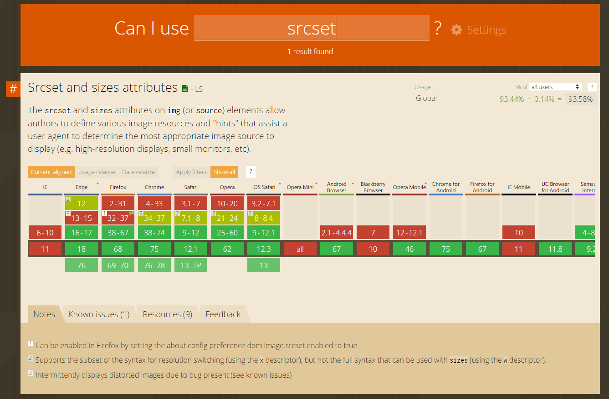

作为在网页性能调优方面常被使用的技巧之一，**懒加载**或者说延迟加载是在谈及「前端性
能优化」话题时不得不说的一项技术。

<!-- more -->

> 延迟加载是一种在加载页面时，延迟加载非关键资源的方法， 而这些非关键资源则在需要
> 时才进行加载。—— [Google Deveplopers]

其实说到懒加载，这项技术已经不局限于单一的图片懒加载。除了图片外，懒加载也早就应用
到了视频、音频等其它媒体资源的优化上，同时随着组件化思维的不断深化，本着懒加载的核
心观点 —— 用户暂时用不到的资源又能延迟去加载的，就大可做成懒加载，WebComponent 也
已经纳入到懒加载优化当中，现代前端各种构建工具、类库，都有做相关的优化，进行组件资
源的按需加载。本文主要把焦点聚集到“图片”的懒加载处理上，做一番探讨。

---

## 原理

图片懒加载的原理其实非常简单：使用手段让 `` 元素默认只载入非常小的图片内容，
再利用 JavaScript 检查元素是否在视口中。 如果元素在视口中，则往其 `src`（有时是
`srcset`）属性中填充真正所需图像内容的地址，加载真正的图片，实现延迟加载。

最早的也是最为有名与流行的实现方式看起来大致如下：

``` html

```

或者使用 base64 内联：
``` html

```

更懒的方式甚至会像下面这样省掉占位用的小图，当然这种方式是不被推崇的，留空的 `src`
属性会带来多余的、有害的网络请求[^1]。你可以完全不写 `src` 属性，这样虽然不符合规
范，但是也能工作，但不要留空 `src`[^2]。

``` html

```

简单直接是这种方式能成为主流的原因。一张宽高仅有 1px 的透明不可见的 blank.gif，作
为默认载入的占位图最合适不过，只有非常小的体积，网页初始化后迅速载入，而真正所需图
像的地址被放到了约定的 `data-src` 属性里。当 JavaScript 代码检测到（通过页面载入/
滚动）图片进入视口时，便将 `data-src` 中的值赋给 `src` 属性，替换掉 blank.gif，触
发原始所需图片的加载。但这种简单有力的方式，有些弊端。

<div class="gad">
  <adsbygoogle ad-layout="in-article" ad-format="fluid" ad-slot="8422573867"/>
</div>

## 问题

首先，其中一个非常直观可见的问题是「**布局抖动**」。在图片懒加载时，由于默认载入的
blank.gif 图片几乎没有大小，真正的图片还没有经过浏览器载入，浏览器就无法确定需要给
原始图片预留多大的位置。当真正的图片加载完成后，网页就会出现肉眼可见的布局抖动问题。
虽然该问题实际对内容本身没有影响，但影响的是用户体验。

![布局抖动（图源：[Davide Calignano]）](../_assets/uploads/2019/07/20190724001.gif)

解决办法是给图片元素设置已知的宽高（元素属性或者 CSS 样式都行），这样浏览器就可以
根据宽高预留位置。

``` html

```

当然固定宽高大小对响应式布局来说不友好，于是就出现了更好的「长宽比盒子」技巧，根据
图片宽高计算出图片的长宽比，利用长宽比与 Padding 边距设定占位元素。

``` html
<div class="aspect-ratio-box">
  
</div>
```

``` css
.aspect-ratio-box {
  position: relative;
  /* 根据宽高比计算设置 box 的 padding-bottom */
  padding-bottom: 62.5%;
}

.aspect-ratio-box img {
  position: absolute;
  height: 100%;
  width: 100%;
}
```

利用长宽比盒子，就能在响应式布局页面中，较好地处理图片懒加载布局抖动的问题。其实更
多的长宽比盒子实际用例是用在响应式 video 元素上，关于长宽比盒子技术，可以进一步阅读
CSS-TRICKS 的文章 —— [Aspect Ratio Boxes]。布局抖动解决后样子如下：

![占位防抖动（图源：[Davide Calignano]）](../_assets/uploads/2019/07/20190724002.gif)

第二个问题是，这个图片懒加载的最原始实现，**没有考虑到响应式图片**（[Responsive Images]）
技术的到来。

``` html

```

不过好在如今的各种 LazyLoad 类库，都已经针对这个问题做了优化，对响应式图片做了兼容。
只需要将原来单一图片的 `data-src` 换成多张图的 `data-srcset` 即可。

``` html

```

在 `data-srcset` 列出可供懒加载使用的响应式图片，类库就会自动根据终端判断加载哪一张。

第三个问题是一个比较严重的问题，问题的根源在于懒加载中 `src` 属性的 blank.gif 这张
占位图本身。为了压缩体积，降低初始载入时间，选用了一张非常小的图。默认载入的这张图
虽然在用户浏览站点自身网页时，没什么区别，因为有懒加载脚本加持。但对于站外来说，这
张小图带来的影响却是致命的，因为站外访问内容时，没有图片懒加载。

这就产生了严重的弊端，blank.gif 懒加载的方式，**对站外 SEO、社会化分享以及 RSS 等稍
后阅读工具非常不利**。除了站点自身，几乎所有站外的工具服务，都不会刻意在引用你的内
容时，帮你处理懒加载。于是，Google 爬虫爬取你的网页内容时，只会爬到带有 blank.gif
的“空白” `` 标签，Google 帮你缓存的网页快照，都会是“缺图”的；同时，通过社会化
分享功能将内容分享到如 Twitter、Facebook 等站外时，你的内容也会是“无图”的；更惨的
是，通过 RSS、Pocket 等稍后阅读工具订阅了你站点内容的读者，他们在阅读工具里无法看
到你文章中所有懒加载的图片，阅读工具里有的，只是空空的 blank.gif。


于是，问题来了之后就触发了又一次的迭代。尝试修正如下：

``` html

```

最直接的更改，选取一张由原图经过压缩后的 small.jpg 作为懒加载占位图，也就是我们常说
的 thumbnail。比如原图的分辨率是 2000x1000，体积是 2MB，经过压缩后的小图是 200x100，
体积是 20KB。这样，初始加载这张缩略图仍然会比加载原图快速，同时站外 SEO、RSS 阅读器
等也能读取到缩略图勉强解决看不到图的问题。这里我们暂且不谈用压缩的小图替换 blank.gif
时带来的额外工作量问题 —— 需要对每一张原图生成缩略图。该方案仍然不是一个完美的方案。

---

## 改进

先抛出一个自我打击：如果一直从“先人”创造的最早的图片懒加载方法入手，打死我也不会想
到下面这个改进的方案。这里我先直接亮出改进方案的实例：

``` html
<div class="aspect-ratio-box" style="padding-bottom:56.25%;">
  
</div>
```

这个改进的图片懒加载方案有包括但不限于以下一些特性：

- 支持响应式图片（Responsive Images）、支持 webp 格式
- 对响应式布局友好、支持移动终端屏幕旋转时进行图片大小重绘
- 使用了 srcset 的特性，在主流的现代浏览器上有完整的支持，同时覆盖率高[^3]
  - 在无法支持 srcset 或者懒加载类库不能生效的旧浏览器上可完美回退（Fallback）
- 对站外 SEO、社会化分享、RSS 稍后阅读等工具服务友好
- 占位用的缩略图可配置性极强，支持多种 placeholder 展示形式

以下来说说这个改进方案的魔法之处。还记得最早的图片懒加载方法吗？没错，就是为了避免
初始加载原图，**刻意**把 `src` 属性的图替换成了空占位图/缩略小图，把原图放到约定的
`data-src` 属性的旧方法：

``` html

```

既然直接在 `src` 属性上动刀会产生那么多问题，那么有没有什么办法能在不改动 `src` 属
性的基础上，通过其它办法避免浏览器初始加载 `src` 属性中的原图，实现懒加载呢？有！
下面说一下改进方案的魔术原理。

1. 首先，带有 `.aspect-ratio-box` 类选择器的外层 `<div>` 标签，是用来保证懒加载图片
在未载入原图时的占位大小的。这个其实是前文说的「长宽比盒子」技巧，解决布局抖动问题，
这里没什么特别点。

2. 改进方案中 `` 标签中的 `src` 属性携带的仍然是原始大小的图片 original.jpg，
确保了站外 SEO、社会化分享、RSS 等不会读不到原图。`src` 中就是未改动的原图，该读取
原图的还是原图。

3. 改进方案中 `` 标签，利用 `srcset` 属性存放了一张缩略图 thumbnail.jpg。正是
这张缩略图，有着与 blank.gif 异曲同工的效果 —— 能够阻止 `` 初始化时 `src` 原
图被加载。**这便是改进方案的关键点**。

4. 最后也是不可或缺的一步，为保证懒加载能正常完成整个逻辑，同时保证对响应式图片的支
持，改进方案中 `` 标签将原本应该在 `srcset` 中的响应式图片列表，存放在了约定
的 `data-srcset` 中。当图片进入视口时，懒加载类库就会用 `data-srcset` 中的响应式图
片地址列表，替换掉实际在 `srcset` 中的缩略图。最后浏览器再根据终端计算判断，选择加
载 `src` 属性与 `srcset` 属性中的图片。



正是通过这么一连串与早期方案截然不同的流程，完美地避开了动刀 `src` 属性产生各种问题
的同时，保证了懒加载功能的正常进行。这一切，全得益于 `srcset` 这个神奇的 HTML5 属性，
以及其与 `src` 属性以及浏览器三者之间的完好协作。

## 后记

这么一个突破固有思维的改进方案，当然不是我一下拍脑子能想得出来的，毕竟我还是太菜了，
有些东西得继续学习。能了解到这个技巧，全赖「业务是驱动技术发展的主要力量」—— 自从博
客更换了系统后，饱受原始图片懒加载方式带来的，布局抖动与 RSS 阅读器不友好的困扰。
一直在寻找更好的方案处理博客文章图片的懒加载，直到最近才从谷歌中搜索到 Ivo Petkov
写的懒加载类库 —— [responsively-lazy]，并进一步阅读了其相关文章，于是才了解到这么
个创新想法。

在目前能找得到的绝大多数 LazyLoad JS 类库中，基本上都是改 `src` 属性的方案，也就存
在改 `src` 产生的问题。Ivo Petkov 的方案真让我耳目一新，只可惜他写的 responsively-lazy
类库已经很久没有维护了，甚至还有使用老式的 getBoundingClientRect() 办法检测元素的
出现，而不是像 [lozad] 那样使用精简有力的 IntersectionObserver API。但这并不妨碍
新方案本身，创新想法上的发光点。

如果你还在犹豫是否使用响应式图片、图片懒加载的话，读到这里，就不要犹豫了。快试试吧，
还能同时用上呢。

## 参考

其它前文未曾列出过的参考文章：

- Lazy load responsive images - Ivo Petkov[^4]
- 图片懒加载从简单到复杂 - OnionTalk[^5]
- Sizing Fluid Image Containers with a Little CSS Padding Hack - Andy Shora[^6]

[Unsplash@emilep]: https://unsplash.com/photos/xrVDYZRGdw4
[Google Deveplopers]: https://developers.google.com/web/fundamentals/performance/lazy-loading-guidance/images-and-video/?hl=zh-cn
[Davide Calignano]: http://davidecalignano.it/lazy-loading-with-responsive-images-and-unknown-height/
[Aspect Ratio Boxes]: https://css-tricks.com/aspect-ratio-boxes/
[Responsive Images]: https://www.ruanyifeng.com/blog/2019/06/responsive-images.html
[responsively-lazy]: https://github.com/ivopetkov/responsively-lazy/
[lozad]: https://github.com/ApoorvSaxena/lozad.js

[^1]: https://csspod.com/frontend-performance-best-practices/#src
[^2]: https://www.quora.com/Is-it-OK-to-omit-the-src-attribute-from-an-IMG-tag-in-HTML
[^3]: https://caniuse.com/#feat=srcset
[^4]: https://ivopetkov.com/b/lazy-load-responsive-images/
[^5]: https://hateonion.me/posts/19jan30/
[^6]: https://www.andyshora.com/css-image-container-padding-hack.html
