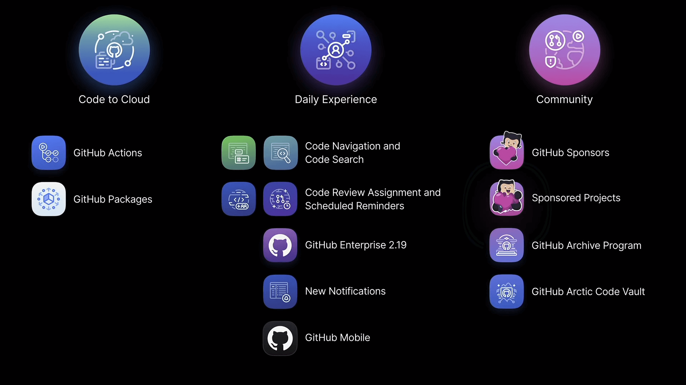
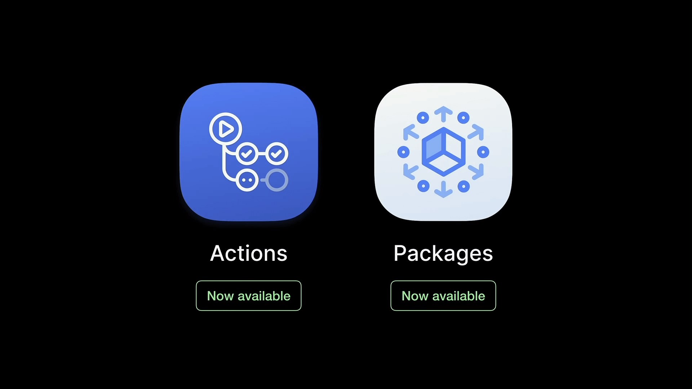
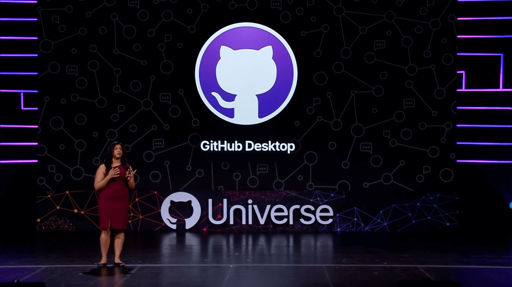
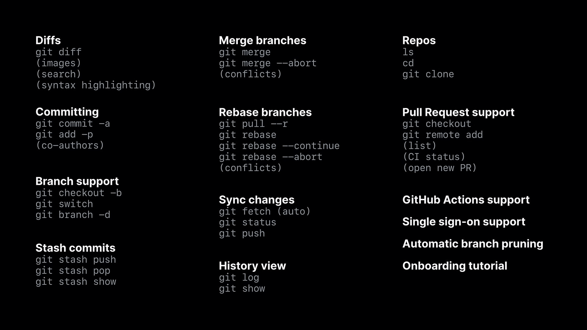
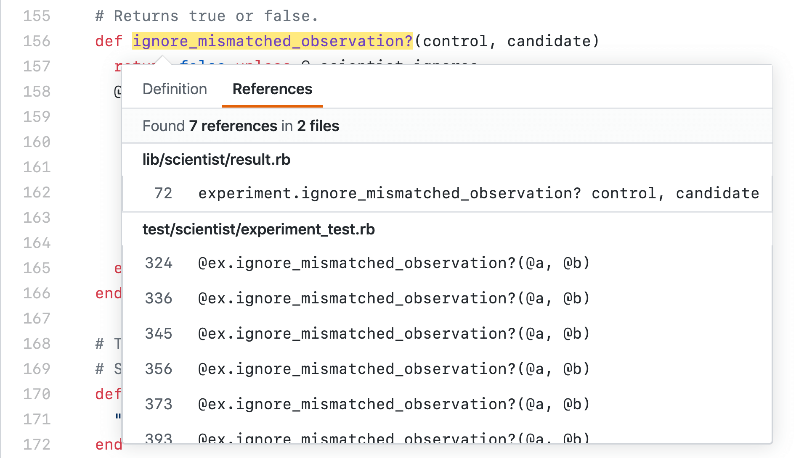
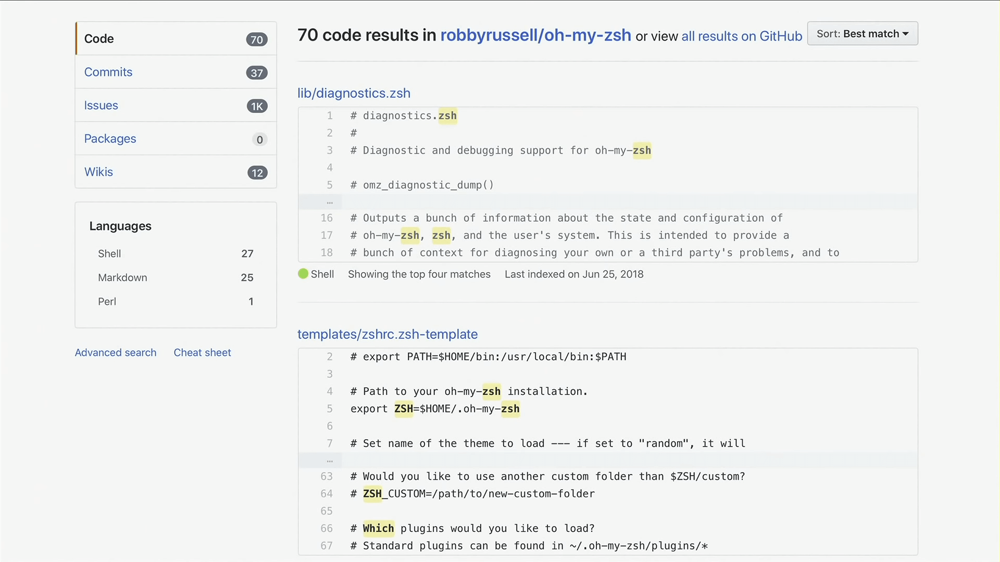
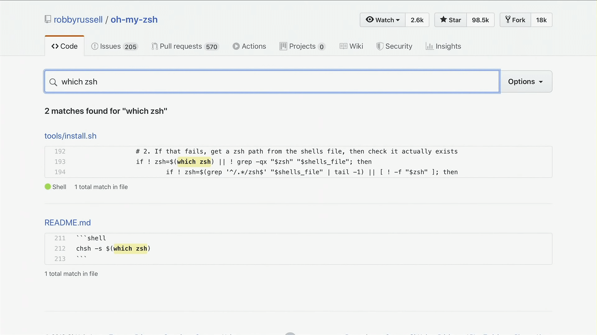
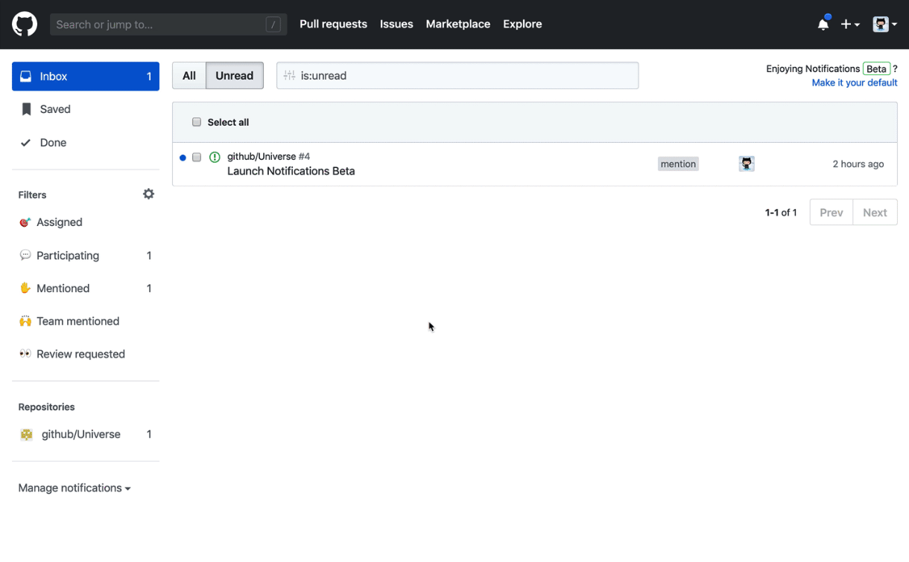
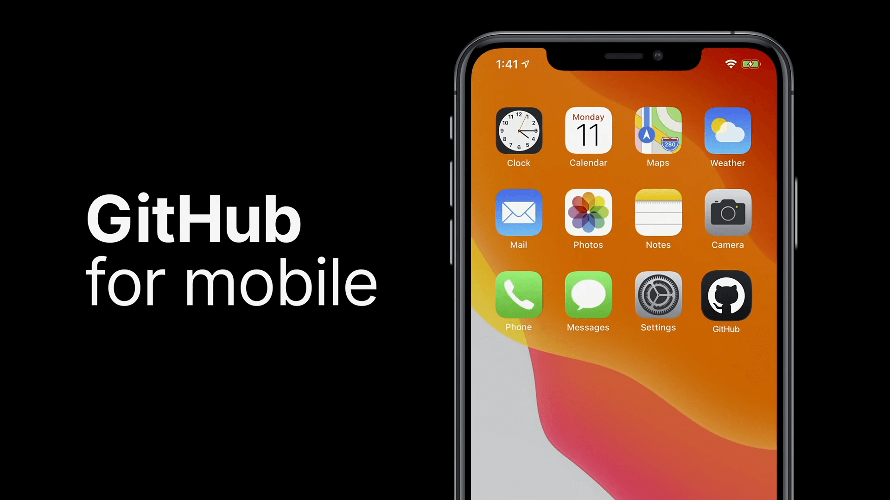
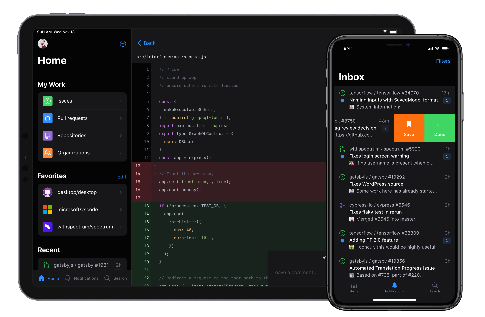

不管是 [GitHub Game Off]，抑或是 [HacktoberFest]，都是 GitHub 近些年来，每年固定
参与举办的活动。像去年的 HacktoberFest 我就有参与，虽然就是做个说难不难 PR 任务，
相关文章 ——《[历经数月，GitHub 章鱼猫寄来的 T 恤竟然……]》，也是挺有趣的（今年的
HacktoberFest 我也参与了，Game Off 也挺想参与，但我一次 gamejam 都没玩过太水了）。

[GitHub Universe] 倒是一个更加正式的开发者大会，每届都会发布一些关于 GitHub 的新
功能新特性，以及其合作友商的动（A）态（D）。不知道是不是我的错觉，总觉得被财大气粗
的微软收购后的 GitHub，搞起各种事情来，就跟同样被微软收购的 Minecraft 搞起 MineCon
一样，越来越正式高端大气上档次了。不过也是因为这都已经是好几届过来的活动了，举办流
程都颇为完善。

---

这次的 GitHub Universe 还是蛮有看点的，干货不少，不过好像都被 GitHub for mobile
这颗耀眼的星给掩盖了。毕竟是“千呼万唤”的官方移动客户端，大家终于等到了。其实除了
Official Mobile App 外，大会上还公布了好几个提升使用体验，值得被注意的新特性。

重点还是在第一天的 Keynote，分为了三大主题：代码上云（Code to Cloud）、日常使用体验
（Daily Experience）以及社区（Community）。其中第二部分最多干货，第三块有点惊喜。

## TL;DR

| 主题 | 产品/特性 |
|------|------|
| 代码上云 | CI/CD 产品 **Actions** 及包托管平台 **Packages** 全体用户免费可用 |
| 日常使用体验 | **官方移动客户端**（GitHub for mobile） **桌面客户端迭代**（GitHub Desktop） **代码导航**（Code Navigation） **改进的搜索功能**（Code Search） **代码审查智能派发**（Code Review Assignment） **定时提醒器**（Scheduled Reminders） **重新设计的通知功能**（Notifications） |
| 社区 | **Sponsors** 迭代，支持团队/项目发起赞助 **存档服务**（Archive Program）及**北极代码库**（Arctic Code Vault） |

## 代码上云

早前发布的两款重磅产品，GitHub Actions 和 GitHub Packages 正式发布，所有用户免费可用。

我实际试用了 Actions，用起来确实是非常赞的。可算是“一站式”解决你的 CI/CD
需求了。

---

## 日常使用体验

这一部分更新很多，都是些很能提升效率和体验的改进或者新特性。

### 1. 桌面客户端更新

这一部分没什么特别亮眼的，就是比较常规的更新介绍。平时有使用 GUI 的话用起来应该会
更加得心应手。

### 2. 代码导航 & 改进的搜索功能

上来首先就介绍了两个很实用功能点。第一个是「代码导航」，这个功能其实早前已经有在测
试了，可以让你在浏览仓库代码时，方便地在函数等定义之间跳转。现在还可以查看到函数被
引用的位置。GitHub 内部用于分析代码找出定义的类库 [semantic] 也是开源的，不过代码
导航这个功能目前只适用于少有的 Python、Ruby 以及 Go 几种语言（GitHub 上的头号热
门语言 Javascript 没被支持，哈哈）。

搜索功能被进行了一次大改，新的搜索终于可以做到大小写敏感、完整精确的匹配了。可以看
下面两张对比结果感受一下。

搜索这个功能是我经常经常经常用到的。就我个人而言，这个真的是一个“杀手级”的更新，太
实用了。搜索功能不好做一直都是技术圈里普遍认同的，特别是中文，更是如此。我有过一段
学习自然语言处理的时光，里面的学问真的很多。

新的搜索功能可以在[这里]进行申请。

### 3. 代码审查智能派发 & 定时提醒器

这两个都是针对团队/组织的功能点。团队管理通过指定不同的代码审查派发模式，可以做到
自动安排不同成员进行 Code Review，责任平均分配。

定时提醒则是整合 Slack。设置定时器后，可以按既定时间发送代码审查等信息到 Slack 中，
更好地帮助团队进行工作。

### 4. 重新设计的通知功能

这个也是一个大的改进，在没有看到这个新设计的通知功能前，我是真没明着抱怨过 GitHub
的通知有多难用。但看到这个新界面后，我才从心里发出感慨 —— 原来通知页还能改得更好用
的。直接在通知功能里面就能处理所有消息，终于不用点一下铃铛点一个消息，处理一下，再
点铃铛处理其他消息了。

### 5. 官方移动客户端

最后一个就是很多用户期待已久的移动 APP 了，这个是官方的、全功能、免费的、原生的客户
端。

作为 iOS 用户，我一直在用的是付费版的 CodeHub，听说 Android 用户比较多用的第三方客
户端是 FastHub。这次 GitHub 推出官方客户端功能齐全，颜值看上去还高，想必会吸引到许
多人去使用的。

而且还有暗黑模式，以及针对 iPad 设备优化了的展示形式。加上全功能的 Photoshop，iPad
的生产力这下真的是提升了很多很多了，虽然我朋友还是认为用来在被窝里看剧是最好的用法。

GitHub for mobile 的 Beta 测试可以在[这个地址]申请。

---

## 社区

除了介绍~~万年 Beta 期的~~ Sponsors 赞助功能开始支持组织/团队外，作为压轴公布了两
个充满社会意义的项目 —— **存档服务**（Archive Program）与**北极代码库**
（Arctic Code Vault）。

[GitHub Archive Program] 将会与斯坦福图书馆、互联网档案馆（[Internet Archive]）、
Long Now 基金会等合作，共同尽最大可能地为后代保留全人类的共同财产 —— 开源软件。

同时 GitHub 还将会在 2020 年 2 月 2 日为所有活跃的公共存储库进行快照备份，利用寿命
可达 1000 年的特制胶片存储这些备份，运送并保存到北极一个地下废弃煤矿中。著名的国际
种子基因库，就坐落在这里 —— 斯瓦尔巴特群岛。

最后，以北极代码库的宣传片做个结尾。挺佩服和欣赏这些大公司，不再只有顾着在商业上发
展，更有在为人类社会未来做出贡献。即使有发展公共关系的成分在里面，不论如何也都是值
得被支持的。SpaceX、Microsoft（Minecraft、GitHub）、蚂蚁金服……

[GitHub Blog]: https://github.blog/2019-11-13-universe-day-one/
[GitHub Game Off]: https://itch.io/jam/game-off-2019
[HacktoberFest]: https://hacktoberfest.digitalocean.com/
[历经数月，GitHub 章鱼猫寄来的 T 恤竟然……]:/blog/2019/01/the-2018-hacktoberfest-shirt-arrived
[GitHub Universe]: https://githubuniverse.com/
[semantic]: https://github.com/github/semantic
[这里]: https://github.com/features/code-search-exact-match/signup
[这个地址]: https://github.com/mobile
[GitHub Archive Program]: https://archiveprogram.github.com/
[Internet Archive]: https://archive.org/
