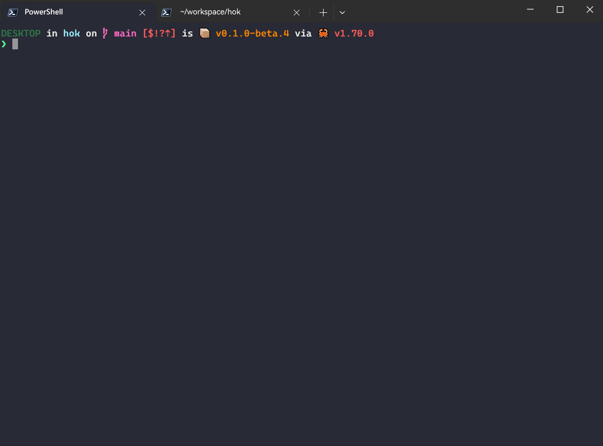
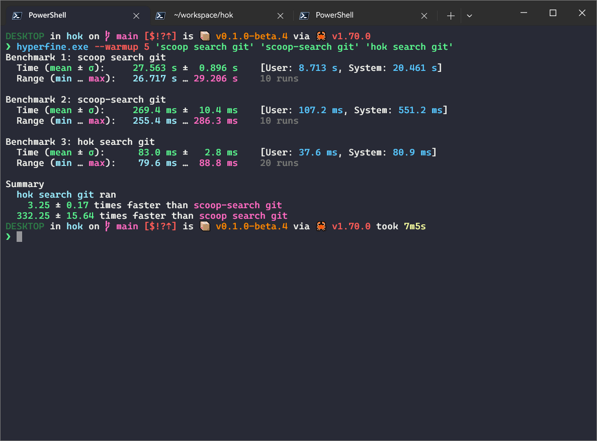

开门见山，先放上项目地址：[https://github.com/chawyehsu/hok][1]

## 前言

了解 Scoop 或者已经是其用户的朋友从标题已经知道本文主题，大概点了上面的链接跳走了。
没点的只好留下来，听我先给不了解的人稍微介绍下 Scoop。[Scoop][2] 是一个在 Windows 下的
工具，通过一套规则来描述应用软件[^1]，然后提供命令行的方式来让用户相对方便地安装和管
理使用的软件。它最初的开发受到过 Homebrew 的启发，虽然随着发展二者已大相径庭，
Scoop 仍然在其 README 中留着对 Homebrew 的 Credit[^2]。

一直以来 Scoop 都没有标称自己是一个包管理器[^3]，但是它的主要功能和主流包管理器的功能
又是有几分相似，所以一些用户愿意称其为 Windows 下的包管理器。相应的，也有（比如偏好
MSYS2 的）用户批评过 Scoop 根本没有提供包管理器「标配」的软件构建环境及 build from
source 的能力，到底只不过是一个「软件安装器」。我作为使用 Scoop 已经有 8、9 年，
于 [2015][3]、[2018][4] 两年先后为其写过两篇「荐」的用户，以为 Scoop 的这种形式更多是
Windows 软件分发现状下的一个些许无奈的折中选择，只能说是有人喜有人愁。强如微软官方
出品 Windows Package Manager —— Winget 也还是没有走出这个窠臼。AppX/MSIX 的打包分发
方式不是所有应用开发者都接受并统一采用，曾几何时我从 UWP 上看到的一点点软件分发整
合的希望也在其放宽 Win32 API 使用后慢慢消去（虽说就开发者角度来说这是好事）。所以
Scoop 在某些场景下仍有它的一席之地，放到末端用户就是各取所需。

---

## 这是什么

接下来谈论的是本文的主角 [Hok][1]。它是一个用 Rust 写的 Scoop 再实现，提供与 Scoop
类似的 CLI 接口，目标是实现 Scoop 已有的功能，如应用的检索、安装卸载、列表与状态、
桶管理等等。实际上 Hok 只是一个 CLI 前端，其背后的 [libscoop][5] 才是这个再实现的
核心。后文会再提到 libscoop。

<!-- more -->

Scoop 用户在饱受着 `scoop search` 极度缓慢的折磨[^4]，带防火墙 debuff 的用户更是如此。
早期的 Scoop 还不支持远程搜索[^5]，那时候搜索速度其实是很可以的。为了解决搜索体验问题，
社区里出现了各种各样的解决方案，比如 Go 实现的 scoop-search 是社区里很流行的一个[^6]，
也有其它如 Python + SQLite 的实现，以及依托 Azure Search 实现的 ScoopSearch（后来
成为了 Scoop 官网上提供的在线搜索[^7]）等等。

然而社区里这些方案，都不约而同地只专注于解决搜索问题，并没有在其它方面做更多的尝试。
也许是搜索问题太过于「碍眼」，导致其它如 `scoop list`、`scoop status` 及 `scoop update`
等命令的效率问题不入法眼。而 Hok 便是在解决了搜索问题的基础上，更进一步去尝试解决
这些也让我难受的点，最终成为一个奔着完整实现而进行的项目。

---

## 开始尝试

假设你已经有在使用的 Scoop 环境，那么你可以使用一下命令来安装体验 Hok：

```powershell
scoop bucket add dorado https://github.com/chawyehsu/dorado
scoop install dorado/hok
```

dorado 是我维护了许久的一个桶，里面有不少我在用的或者接收 Pull Request 进来的软件。
Hok 是 native 的，可以脱离 Scoop 运行，所以其实也可以从 GitHub Release 页面下载
二进制文件直接使用。但是因为 Scoop 的一些功能在 Hok 上还未被实现，所以单独用 Hok
的话会缺失关键功能，建议还是附在 Scoop 上。

安装完成后，可以使用 `hok help` 先查看 Hok 的帮助信息，了解下 Hok 的命令行接口：

```
$ hok help
Hok is a CLI implementation of Scoop in Rust

Usage: hok.exe <COMMAND>

Commands:
  bucket     Manage manifest buckets
  cache      Package cache management
  cat        Inspect the manifest of a package
  cleanup    Cleanup apps by removing old versions
  config     Configuration management
  hold       Hold package(s) to disable changes
  home       Browse the homepage of a package
  info       Show package(s) basic information
  install    Install package(s)
  list       List installed package(s)
  search     Search available package(s)
  unhold     Unhold package(s) to enable changes
  uninstall  Uninstall package(s)
  update     Fetch and update subscribed buckets
  upgrade    Upgrade installed package(s)
  help       Print this message or the help of the given subcommand(s)

Options:
  -h, --help     Print help
  -V, --version  Print version

Type 'hok help <command>' to get help for a specific command.
```

为了照顾一些个使用习惯，Hok 的命令行接口被设计得与 Scoop 的接口有一定的相似性，
比如 `hok bucket`、`hok home`、`hok hold/unhold` 等。但是由于 Hok 背后的 libscoop
在内部实现上与 Scoop 不尽相同（主要是多了一些我个人的思考及针对我个人使用习惯的调整），
所以体现到 Hok 的命令行接口上也有了一些变化。接下来我会逐一对目前 Hok 提供的各
个命令做具体的介绍。这部分也许该写成使用文档放到项目里，但目前就先放在这吧。

---

### hok bucket

桶管理命令。这个子命令与 Scoop 的 `scoop bucket` 子命令几乎一致，唯一的一个不同是
Scoop 使用 `scoop bucket known` 来列出内置的（官方）桶[^8]，而 Hok 使用 `hok bucket list -k|--known`
来做同样的事情。

```
$ hok bucket --help
Manage manifest buckets

Usage: hok.exe bucket [COMMAND]

Commands:
  add     Add a bucket
  list    List buckets
  remove  Remove bucket(s)
  help    Print this message or the help of the given subcommand(s)

Options:
  -h, --help  Print help
```

### hok cache

下载缓存管理，对应 `scoop cache`。Scoop 使用 `scoop cache [show]` 列出下载缓存列表，
Hok 使用 `hok cache list [query]`，其中 `query` 可以作为过滤条件，只列出包含 `query`
的缓存。

Scoop 使用 `scoop cache rm <app|*>` 来删除缓存，类似的 Hok 使用 `hok cache remove <query>`
来删除缓存，其中 `query` 同样支持通配符 `*` 删除全部缓存。

```
$ hok cache --help
Package cache management

Usage: hok.exe cache [COMMAND]

Commands:
  list    List download caches
  remove  Remove download caches
  help    Print this message or the help of the given subcommand(s)

Options:
  -h, --help  Print help
```

### hok cat

全文输出包的 manifest 详情。`hok cat` 与 `scoop cat` 的用法完全一致，但是 `hok cat`
多了对同名包的选择功能，如果你本地的不同桶之间存在同名的包的话，`scoop cat <app>`
会自动选择第一个找到的包，而 `hok cat <app>` 则会列出所有同名包，让你自己选择。

```
$ hok cat --help
❯ hok cat
Inspect the manifest of a package

Usage: hok.exe cat <package>

Arguments:
  <package>  Name of the package to be inspected

Options:
  -h, --help  Print help

$ hok cat git
Found multiple packages named 'git':

  0. dorado/git (https://gitforwindows.org)
  1. main/git (https://gitforwindows.org)

Please select one, enter the number to continue: 0
```

同名包的选择功能在 `hok home` 等其它命令中也同样存在。

### hok cleanup

清理命令，对应 `scoop cleanup`。Hok 暂未实现 cleanup 功能，所以在这里它只是个 placeholder。

```
$ hok cleanup --help
Cleanup apps by removing old versions

Usage: hok.exe cleanup [OPTIONS] [app]...

Arguments:
  [app]...  Given named app(s) to be cleaned up

Options:
  -k, --cache  Remove download cache simultaneously
  -h, --help   Print help
```

### hok config

配置管理命令。Scoop 使用 `scoop config` 展示配置，Hok 使用 `hok config list` 以
JSON 格式展示。Scoop 使用 `scoop config <key> <value>` 设置配置，Hok 使用
`hok config set <key> <value>` 来设置配置，Scoop 允许给任意 `key` 设置值，而 Hok
会检查 `key` 是否合法。Scoop 使用 `scoop config rm <key>` 删除配置，Hok 使用
`hok config unset <key>` 来删除配置。

```
$ hok config --help
Configuration management

Usage: hok.exe config [COMMAND]

Commands:
  edit   Edit the config file [default editor: notepad]
  list   List all settings in key-value
  set    Add a new setting to the config file
  unset  Remove a setting from config file
  help   Print this message or the help of the given subcommand(s)

Options:
  -h, --help  Print help
```

Hok 支持使用 `hok config edit` 命令调用外部编辑器来编辑配置文件。Hok 会使用环境变量
`EDITOR` 的值作为调用的编辑器，比如设置了 `EDITOR=nano`，`nano` 就会被用作打开配置
的编辑器。如果没有 `EDITOR` 环境变量，Hok 会使用 `notepad` 来打开配置文件。



Hok 完全继承并兼容 Scoop 的配置文件，虽然 Hok 不会去使用其中如 aria2 等的配置项，
但是为了兼容性 Hok 支持解析和编辑这些配置。Hok 甚至已经率先支持 portable config
file[^9]。

### hok hold/unhold

包锁定/解锁命令，对应 `scoop hold/unhold`。Hok 的 `hold` 和 `unhold` 命令均与
Scoop 对应命令的用法一致。

```
$ hok hold --help
Hold package(s) to disable changes

Usage: hok.exe hold <package>...

Arguments:
  <package>...  The package(s) to be held

Options:
  -h, --help  Print help

$ hok unhold --help
Unhold package(s) to enable changes

Usage: hok.exe unhold <package>...

Arguments:
  <package>...  The package(s) to be unheld

Options:
  -h, --help  Print help
```

### hok home

打开包主页的命令。Hok 的 `home` 命令与 Scoop 对应命令的用法一致，但是 `hok home`
多了对同名包的选择功能，具体说明见上文 `hok cat`。

```
$ hok home --help
Browse the homepage of a package

Usage: hok.exe home <package>

Arguments:
  <package>  The package name

Options:
  -h, --help  Print help

$ hok home pixitracker
Found multiple packages named 'pixitracker':

  0. dorado/pixitracker (https://www.warmplace.ru/soft/pixitracker/)
  1. extras/pixitracker (https://warmplace.ru/soft/pixitracker/)

Please select one, enter the number to continue: 1
```

### hok info

包信息命令，对应 `scoop info`。Hok 的 `info` 命令与 Scoop 对应命令有所不同，
`scoop info <app>` 只会精确匹配包名，而 `hok info <query>` 中的 `query` 是一个
正则表达式入参，当输入 `hok info git` 时会列出所有包名中包含 `git` 的包的信息。

```
$ hok info --help
Show package(s) basic information

Usage: hok.exe info <query>

Arguments:
  <query>  The query string (regex supported)

Options:
  -h, --help  Print help
```

### hok install

包安装命令。在对包的安装、更新、卸载操作上，Hok 有着一套相对于 Scoop 改动比较大的设计，
这也是 Hok 及其背后的 libscoop 之于 Scoop 区别最大的部分。依托于这部分设计改动，
Hok 得以实现对同名包的选择与替换、锁定包强制更新等功能。

```
$ hok install --help
Install package(s)

Usage: hok.exe install [OPTIONS] <package>...

Arguments:
  <package>...  The package(s) to install

Options:
  -d, --download-only   Download package(s) without performing installation
  -f, --ignore-failure  Ignore failures to ensure a complete transaction
  -o, --offline         Leverage cache and suppress network access
  -y, --assume-yes      Assume yes to all prompts and run non-interactively
  -D, --ignore-cache    Ignore cache and force download
  -I, --independent     Do not install dependencies (may break packages)
  -R, --no-replace      Do not replace package(s)
  -S, --escape-hold     Escape hold to allow changes on held package(s)
  -U, --no-upgrade      Do not upgrade package(s)
      --no-hash-check   Skip package integrity check
  -h, --help            Print help
```

但是截至目前 libscoop 在这部分功能的实现上还不完整，所以 Hok 的 `install`
命令也是不完整的，一些参数的功能也还未实现。具体实现到什么程度，可以自行体验或者
查看源码和 CHANGELOG。`hok install <package>` 中的 `package` 同样支持 Scoop
那样的桶前缀指定，比如 `dorado/git`。

```
$ hok install git -DS
Resolving packages...
Found multiple candidates for package 'git':

  0: dorado/git
  1: main/git

Please select one, enter the number to continue: 1
Calculating download size...
The following packages will be REPLACED:
  doradomain/git

Total download size: 55 MB

Do you want to continue? [y/N]: n
Not implemented yet.
```

### hok list

已安装包的列表命令。Hok 的 `list` 命令与 Scoop 对应命令的基础用法一致，同时提供
复杂的筛选功能。`hok list [query]` 中的 `query` 是一个正则表达式入参，支持以正则
表达式的方式对已安装包的列表进行筛选。同时 `query` 还支持桶前缀指定。结合正则和
桶前缀，可以实现诸如 `hok list extras/`、`hok list "dorado/^[c|g]"`、
`hok list main/git$` 这样的筛选。Hok 还支持使用 `hok list --held` 查看被锁定的包。

```
$ hok list --help
List installed package(s)

Usage: hok.exe list [OPTIONS] [query]...

Arguments:
  [query]...  The query string (regex supported by default)

Options:
  -e, --explicit    Turn regex off and use explicit matching
  -u, --upgradable  List upgradable package(s)
  -H, --held        List held package(s)
  -h, --help        Print help
```

Hok 将原本属于 `scoop status` 的查看可更新包的功能移到了 `hok list` 中，
使用 `hok list --upgradable` 可以查看可更新包的列表。

```
$ hok list dorado/^g --upgradable
git/dorado 2.41.0.windows.1 -> 2.41.0.windows.3 [held]
gnupg-np/dorado 2.4.2 -> 2.4.3
```

### hok search

包搜索命令。搜索功能可以说是整个 Hok 项目的核心，也是因为 Scoop 的搜索效率问题，
才有了 libscoop 和 Hok。Hok 的 `search` 命令与 Scoop 对应命令的不同点在于，
`scoop search` 会远程搜索那些没有挂载到本地的官方桶，`hok search` 只会搜索本地桶。
另外，`scoop search` 强制对包名、包描述以及 shim 均进行匹配，而 `hok search`
默认只对包名进行匹配，提供 `--with-description` 和 `--with-binary` 选项来开关对
shim 和包描述的匹配。这些调整为的都是最大化搜索效率。

```
$ hok search --help
Search available package(s)

Usage: hok.exe search [OPTIONS] <query>...

Arguments:
  <query>...  The query string (regex supported by default)

Options:
  -e, --explicit          Turn regex off and use explicit matching
  -B, --with-binary       Search through package binaries as well
  -D, --with-description  Search through package descriptions as well
  -h, --help              Print help (see more with '--help')
```



与 `hok list` 一样，`hok search <query>` 中的 `query` 同样是一个正则表达式入参，
支持正则搜索，可以使用 `--explicit` 选项来关闭正则，转为使用精确匹配。同样的，
这里的 `query` 也支持桶前缀指定，也是一个变长入参，可以同时指定多个查询。

```
$ hok search minecraft extras/^clash ^git$
clash-verge/extras 1.3.5
clash.mini/extras 0.2.2
git/dorado 2.41.0.windows.3 [installed: 2.41.0.windows.1]
git/main 2.41.0.3
minecraft/games nightly
```

### hok uninstall

包卸载命令。上文讲到，与 Scoop 相比，Hok 对包的安装、更新、卸载操作有较大改动。
`hok uninstall` 执行时默认会检查待卸载包的依赖关系，如果有其他包依赖待卸载包，
则会终止卸载操作，避免破坏依赖。这应该是正常策略，只是 Scoop 好像没有考虑到这点。
通过使用 `--no-dependent-check` 可以关闭这个依赖检查，强制卸载待卸载包，
这可能会导致其他包无法正常运行。

```
$ hok uninstall --help
Uninstall package(s)

Usage: hok.exe uninstall [OPTIONS] <package>...

Arguments:
  <package>...  The package(s) to uninstall

Options:
  -c, --cascade             Remove unneeded dependencies as well
  -p, --purge               Purge package(s) persistent data as well
  -y, --assume-yes          Assume yes to all prompts and run non-interactively
      --no-dependent-check  Disable dependent check (may break other packages)
  -S, --escape-hold         Escape hold to allow to uninstall held package(s)
  -h, --help                Print help
```

默认情况下，被锁定的包无法被卸载，使用 `--escape-hold` 可以绕过这个限制，
强制卸载被锁定的包。此外，`hok uninstall` 支持使用 `--cascade` 选择开启「级联卸载」，
这会在卸载包时同时检查其依赖，如果依赖包不再被其他已安装包依赖，则会一并卸载。
`--purge` 选项与 `scoop uninstall --purge` 一致，用于卸载包时一并清理包的持久化数据。

```
$ hok uninstall swift --cascade
Resolving packages...
The following packages will be REMOVED:
  dorado/swift-5.8.1  main/dark-3.11.2

Do you want to continue? [y/N]: n
```

与 `hok install` 一样，`hok uninstall` 的主体功能尚未完整实现，请留意项目 CHANGELOG。

### hok update

桶更新命令。Hok 的这个命令只保留了 `scoop update` 里更新所有订阅到本地的桶的功能。

```
$ hok update --help
Fetch and update subscribed buckets

Usage: hok.exe update

Options:
  -h, --help  Print help
```

### hok upgrade

包更新命令。与 Scoop 的 `scoop update` 更新包相对应的功能，在 Hok 中被移到了
`hok upgrade` 这里。`hok upgrade` 类似于 `scoop update *`，会更新所有已安装包，
除了被锁定的包。被锁定的包可以通过 `--escape-hold` 选项来强制更新。使用带参的
`hok upgrade [package]` 可更新指定的包。

```
$ hok upgrade --help
Upgrade installed package(s)

Usage: hok.exe upgrade [OPTIONS] [package]

Arguments:
  [package]  The package(s) to be upgraded (default: all except held)

Options:
  -f, --ignore-failure  Ignore failures to ensure a complete transaction
  -o, --offline         Leverage cache and suppress network access
  -y, --assume-yes      Assume yes to all prompts and run non-interactively
  -S, --escape-hold     Escape hold to allow to upgrade held package(s)
      --no-hash-check   Skip package integrity check
  -h, --help            Print help
```

无论是 `hok upgrade` 还是 `hok install` 默认状态下都会结合本地下载缓存的情况预先
获取并计算需要下载的文件大小，而通过 `--offline` 选项可以关闭网络访问，强制只使用
本地的下载缓存来安装或更新。但这取决于本地缓存的有效性，如若无效，安装或更新操作会失败。

```
$ hok upgrade git --escape-hold
Resolving packages...
Calculating download size...
The following packages will be UPGRADED:
  dorado/git-2.41.0.windows.3

Nothing to download, all cached.

Do you want to continue? [y/N]: n
```

以上就是 Hok 目前阶段提供的所有命令的介绍。通过这些介绍，应该可以大致了解到 Hok
的开发思路。因为还在绝赞进行中，所以命令的功能还不完整，有些甚至还未实现，
只是预留了个坑在那里。所以完全有可能会变化，还是那句请留意项目 CHANGELOG 以了解
最新进展。

---

## 为什么做

关于这个，在文章开头部分其实已经有所提及。一开始完全是因为 `scoop search`
的搜索效率问题，继而想去解决更多我个人使用 Scoop 时遇到的痛点。Hok 这个项目其实
是「老坑新开」的，有心的可以去仓库翻 git log 了解一下，早在两年前我就已经下锄头
挖坑了，只是中途断了一段时间，最近才又开始填坑。个中原因不便细说，反正是按自己
需求来的个人项目，见步行步。

### 为什么不直接贡献 Scoop

实话说，我作为 Scoop 的 maintainer team 成员之一，不去贡献 Scoop 而是自己写一个
新的东西，这好像是有点说不过去。但是 Scoop 作为一个近 10 年的项目，拥有我觉得还
挺庞大的用户量，我是不太能按个人想法去改动一些东西的，会很容易影响到其他用户。
而且不是说一个 maintainer 就能确定发展方向，有积累的项目就会有惯性，想要改动一些
东西也不是那么容易的。按自己的需求来做个新的相对容易推动些，另外这也算是个试验田，
也许能在后续给 Scoop 带来一些反向作用力，进而反哺回去。

### 为什么是 Rust

这似乎是个逃不开的话题，尤其是在好像「Rewrite Everything in Rust」被调侃成为一个
梗之后。既然选择了 Rust 写 Hok，是要回答一下。理由其实很简单，我单纯想学 Rust，
所以就用 Rust 来开坑了。这几年是切身感受到了 `ripgrep`、`bat`、`hyperfine` 以及
`starship` 等项目给我带来的愉悦，也许这些项目背后的 Rust 语言不过是一个次要因素。
这里并不是如那般狂热的 RIIR 信徒[^10]，因为不是用 Rust 写一遍就能解决所有问题，
任何语言，背后关键的还是人和思想。Rust 的学习曲线也确实挺如网络上传说的那般陡峭，
对于我这种仍未学会 C++ 的人来说更甚，真的是有「从入门到入门，到再三入门」的感受。
而且学了没地方用，非常容易忘，我好像又忘了 Pin/Unpin 和一些其它的东西了。虽说如此，
那个连续数年被评为最想学语言的 Rust 还是值得我去探索一下，学 Rust 后反过来再尝试
读一些 C/C++ 的代码，至少我觉得会有一些帮助。

Hok 完全可以用其它语言来写。Scoop 是用 PowerShell 编写的，理论上用 PowerShell
背后的 .NET/C# 来写会更方便和直接一些，甚至可以无缝过渡。PowerShell 直到 v7 才支持
`ForEach-Object -Parallel`[^11]，Scoop 目前还得支持 v5 的 Windows PowerShell，
所以继续用 PowerShell 改善 Scoop 的性能问题是有点技术包袱的。然后 Scoop 最近的
一些优化改动，多少其实都在渐渐引入一些 .NET/C# 的接口，并非纯纯 PowerShell 实现。

---

## libscoop 的 roadmap

Hok 项目的核心是其中的 libscoop 库，之所以抽出 libscoop 这层抽象，当然是为了后续
hok-gui 甚至 hok-tui 的可能，不过这都是待定的事情，也不一定做（得出来）。
目前短中期的路线图主要是完成 `(un)install`/`upgrade` 等核心命令的实现。这里面我
认为的一大难点是如何处理那些带着一长串 PowerShell 脚本的包，这些脚本基本都是用来
做一些复杂的安装卸载工作，而且这些脚本的上下文多少都是依赖于 Scoop 本身的。Scoop
允许利用钩子脚本做一些额外的工作，却完全将其内部所有细节暴露了出来，导致不少
manifest 有点滥用 Scoop 内部功能的情况。在 Rust 侧除了考虑是直接 Command call
还是实现 native hosting 来执行这些脚本外，还得考虑如何提供这些执行上下文。另外
shimming 如何处理以什么形式分发也是个问题。

## 结语

Hok 毕竟是一个实验性质的个人项目，但我想把它分享出来，收获一些正向反馈也好负向
反馈也罢，至少有些作用力。埋头搞事只有输入没有输出的状态挺让人难受的，是需要些
正反馈。

上一次写博客还是世界巨变的几年前，博客至少还在线哈哈。这是我这些年以来第三次
写关于 Scoop 的内容，按这个越写越长的趋势，不知道还会不会有第四次呢。

如果你对 Hok 这个项目感兴趣，或者有什么想法，欢迎借由各种途径留言。

回见。

[^1]: https://github.com/ScoopInstaller/Scoop/wiki/App-Manifests
[^2]: https://github.com/ScoopInstaller/Scoop#inspiration
[^3]: [A command-line installer for Windows.][2]
[^4]: https://github.com/ScoopInstaller/Scoop/issues/4239
[^5]: https://github.com/ScoopInstaller/Scoop/commit/bea31895
[^6]: https://github.com/shilangyu/scoop-search
[^7]: https://github.com/ScoopInstaller/scoopinstaller.github.io-indexer
[^8]: https://github.com/ScoopInstaller/Scoop/blob/master/buckets.json
[^9]: https://github.com/ScoopInstaller/Scoop/pull/5369
[^10]: https://github.com/ansuz/RIIR/issues/
[^11]: https://devblogs.microsoft.com/powershell/powershell-foreach-object-parallel-feature/

[1]: https://github.com/chawyehsu/hok
[2]: https://scoop.sh
[3]: /blog/use-scoop-to-enhance-windows-powershell
[4]: /blog/talk-about-scoop-the-package-manager-for-windows-again
[5]: https://crates.io/crates/libscoop
