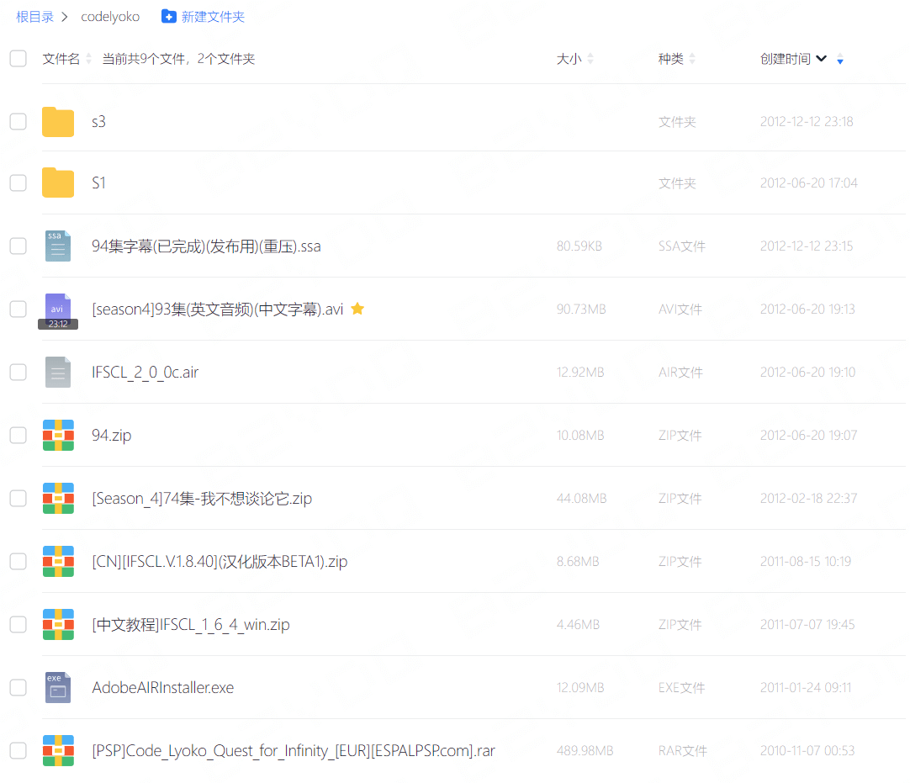

发现 Code Lyoko 相关异常信号，正在进行检测与确认……

是否进行记忆扇区重建？ [y/N]

正在准备虚拟化环境…… 加载完成。

启动同步……

---

## 回放

2010 年，彼时高中成绩还算稳定的缘故，我获得机会，拥有了人生中第一台属于自己的电脑。
那是一台戴尔的迷你上网本，配置很低，CPU 是英特尔的凌动处理器。以今天的眼光来判断，
此选择真是失败，同样的预算当时完全可以得到一台配置更高的。只是那时我对硬件一窍不通，
完全是凭借「品牌+便携」两个关键词做下的选择。

虽然是一台笔记本电脑，一台比常规笔电更加便携的上网本，但彼时寄宿制高中生活的我，
有且只有在节假日和寒暑假时段才能触摸到放在家中的这台电子设备。而这也让我对这台
电脑的使用，变得与初中走读时期偷偷去网吧玩游戏的感受完全不同。虽然也偶尔会玩各种
游戏，但更多的时间是用来给我的 MP3 播放器下载拷贝歌曲以及下文讲到的字幕组工作。

寄宿高中禁止携带电脑，在那个网络资费还是高昂的时期，即使默许携带（以便于联系家长）
的手机拥有访问网络的能力，30M 每月的数据流量对于我来说还是连一首歌曲也不敢下载。
流量更多地被用于文字类的聊天、内容搜索浏览以及「文字偷菜」等游戏上。这时候，更小
巧的 MP3/4 播放器就成了同学们的掌中宝物。MP3 除了能听单词助记忆外，还能听有声
小说和音乐，待机时间也长。听音乐便成了我高中生活的一个重要组成部分，同时也极大地
影响我往后的生活。

那会儿，我的 MP3 里面有相当一部分音乐是一些动画片的 OP/ED 之类的歌曲，除了包括
知名的《数码宝贝》的 Butter Fly、Break up!、Brave Heart 等，《中华小当家》、
《名侦探柯南》的众多 OP/ED（其中也有我的本命 band GARNET CROW 的 tie 曲）外，
还有非常喜爱的《我为歌狂》的我的舞台和有梦好甜蜜，《四驱兄弟》、《光能使者》的国语
版 OP 等国语曲目。在这些之外，有一首特别的英文曲目，它的名字是「A World Without Danger」。

<!-- more -->

<figure>
  <iframe loading="lazy" src="https://music.163.com/outchain/player?type=2&id=22580308&auto=0&height=50"></iframe>
</figure>

是的，它便是《虚幻勇士》的英文版 OP 原曲。我使用手中的电脑，借助搜索引擎从百度
mp3 等平台听到了不少以上提及动画片的歌曲，《虚幻勇士》就是其中一个。除了找到了
这首英文 OP 外，我当时还从土豆网上看到了这部动画片未曾在大陆播出的第三、四季，
同时了解并加入了 Code Lyoko China 论坛社区。只是那时候并不知道 CLC 彼时已经是
一个濒临解散的社区，这也为我后续涉足字幕组埋下了伏笔。

靠着土豆网上由 CLC 制作组自发译制的《虚幻勇士》第三、四季的视频，我几乎补完了
这部动画片的后续剧情。

![土豆网 CLC 制作组播单快照[^1]](../_assets/uploads/2023/09/20230901001.png)

说「几乎」是因为当时并未通过 CLC 制作组播单看完全部剧集。根据我的记忆加上历史档案，
其播单最终停在了第四季第 90 集，最后 5 集因片源问题未能完成译制，直至论坛关闭。
不甘 CLC 衰落的坛友计划筹建新的社区基地，也就是后来的 CLCN。当时我正渴望补完最后
几集，在 CLC 还在过渡到 CLCN 的阶段中，借着找到片源的契机，我跟着坛里的成员合作
完成了第四季其中的第 93、94 集的译制。

那时 CLCN 制作组的名号还未被启用，译制作品还是以 CLC 名义发布的，而最后也只正式
发布了第 93 集，第 94 集的「遗产」则是被后来的 CLCN 在其重制计划中吸收继承了。

在之前，我对字幕组的工作流是一无所知的。凭借着搜索引擎与一腔热血，我先后把
SRT/SSA、VobSub/VSFilter 以及 MeGUI 等工具学了一遍。还记得当时为了保持与 CLC
制作组相似的风格，要把英语音频抽出来切割后与法语视频在时间上对齐就花了不少时间。
回头看那时候真是无知者无畏，拿着一台笔记本电脑搞字幕组的活，要知道那是一台不到
11 寸，板载低功耗低频的凌动处理器的上网本。最后开着它挂通宵机二压出成品的日子，
让我至今难忘。

## 断档

除了「小刀砍大树」的方式进行字幕组工作外，那段时间我还因为发现 IFSCL 这个制作
优良的同人 Flash 游戏，给其翻译了一版用户手册分享给坛友们，没记错的话那份文档
大概是当时我在坛里的最终贡献。后来 CLCN 成立，我加入其中并活跃了一段时间，也参与
了第五季真人版最早期的一些译制。在现实生活与兴趣变化的影响下，字幕组相关的工作
于我并没有持续多久。在之后我把所学的技能用在给 GARNET CROW 的歌曲做字幕上，完成
了其最终 Live 的字幕制作的同时，也给我短暂的字幕组经历画上了句号[^2]。

虽然当初学习的各种 MeGUI 压制参数等等已经完全忘记，一些多媒体知识仍然在我脑海中
留下了痕迹，特效字幕的学习与制作也相当程度提升了我对技术乃至编程的热情。现今视频
自媒体、AI 翻译与字幕各种先进技术和方案普及，多媒体已不再是普通人难以接触的领域知识。

字幕组的这段经历是深刻的，然而引发这一切的根源之于我却是陌生的。在很长时间里，
我想不起我具体在什么时候看过这部动画片。某段时期在浏览网络上他人关于《虚幻勇士》
印象的各样讨论，我甚至一度对自己在哪个就学时期看过这部动画片产生了怀疑。也许是
现实渐长的迷惘和焦虑心情，对那段美好时光产生了挤压和覆盖。我热切希望寻找到关于
这个断档时期的一些直接痕迹。

## 重建

年中，我在给 MusicBrainz 平台贡献 GARNET CROW 以及其他音乐人的音乐元数据时，
意外地开启了一小段高频率使用搜索引擎和<ruby>互联网档案<rt>Internet Archive</rt></ruby>
的时间。为了提供准确的音乐元数据信息，我除了在各音乐发行版权登记平台上蒐集标准
数据字段外，还借由互联网档案工具查询一些已经难以正常访问的信息，比如不同音乐曲目
之间的关联。在这个过程中，我发现了一些我此前未曾了解的有趣信息。比如其中一个是
关于陈慧娴的《跳舞街》超多个不同演唱版本的信息[^3]，另一个则是关于 GARNET CROW
最早期地下专辑《first kaleidscope 〜君の家に着くまでずっと走ってゆく〜》在正式
发行前的预发行版本的切实证据。

在完成了音乐元数据的搜寻工作后，我没有停下来。我想趁热打铁，继续去寻找我在什么
时间看过《虚幻勇士》的线索。在此之前，我曾尝试利用搜索引擎几次检索关于《虚幻勇士》
在大陆地区电视台上播出的信息。只是，一方面众所周知大陆中文互联网历史数据留存情况
和可访问性并不乐观，另一方面便是被传播最多的《虚幻勇士》「盗版永封」事件，导致
中文区很难找到相关有用的线索。这次我想借着音乐元数据蒐集工作的好运气，再次尝试一下。
而这次的结果是——我那段断档的记忆，变得无比清晰。

我使用的线索是我唯一确信的一点：我在南方电视台上收看的《虚幻勇士》。我对此印象
最深的就是台标是 TVS 标，至于是哪个频道我印象不深，网络上的评论一说是 TVS-6 一说
是 TVS-5。通过南方电视台的维基页面得知其在 2014 年已被合并，官网已关闭，另外维基
指出 TVS-6 在 2005~2006 年间台标出现过变更，从原来的 TVS-6 改成了 TVS-5，
不变的是仍然为少儿频道，播出动画等内容。

通过关键字「虚幻勇士 国产」我找到了广电于 2007 年发布的对 2006 年度电视动画发行
许可的通告原文[^4][^5]，其中谈及《虚幻勇士》假冒国产动画的封禁：

> 由上海录像影视公司、上海文广新闻传媒集团、广东安利伟影视制作有限公司（现已更名
> 为广东原色动力影视制作有限公司）联合制作，并已取得国产电视动画片发行许可证的
> 动画片《虚幻勇士》（沪动审字〔2006〕第003号）是一部假冒的国产动画片；

通过 Wayback Machine 我发现南方电视台的官网有快照信息，并且在 2010 年之前的快照
页面上可以浏览到快照当天的部分节目预告清单。我挑了几个关键年份快速浏览了每个首页
快照的节目预告信息，发现首页快照上的节目预告是所有频道混排的，能提供的信息有限，
我转而去浏览了 TVS-5 和 TVS-6 的频道页面快照。经过一番浏览我发现一个信息，
在 2007 年 8 月份的一快照上显示 TVS-5 频道播出的仍然是科教节目，同年 10 月的快照
才显示了少儿频道的节目清单。也就是说，事实上 TVS-6 到 TVS-5 的频道切换最少是在
2007 年 8 月至 10 月之间完成的，并非维基百科上所言的 2005~2006 年间。我结合广电
的通告时间，重点关注了 TVS-6 频道的页面快照，并最终在其 2006 年 9 月 2 日的快照
上找到了我想要的信息。

![超级卡通影城播出《虚幻勇士》[^6]](../_assets/uploads/2023/09/20230901003.png)

找到这张图的结果并非写得这样容易。事实上我在第一遍翻查快照时，翻遍了 Wayback Machine
上 TVS-6 从 2003 年至 2008 年的全部数百个快照，也许是粗心还是其它因素，并没有发现上图。
在第二遍翻查时，重点浏览 2006 至 2007 的快照，才找到了 2006 年 9 月 2 日这一天。
而在之后的第三遍翻查时，我才意识到，整个 2006 年 9 月到 10 月，就刚刚好只有 9 月
2 日这一天有快照，并且上面刚好登记了「17:30 超级卡通影城栏目播出《虚幻勇士》第
3、4 集」的预告。换句话说，上图中的信息是「独此一份」，是目前网络上公开可查且
唯一的关于当年南方少儿频道 TVS-6 曾播出过《虚幻勇士》的直接证据！音乐元数据搜寻
工作的好运气没有消散。

由于快照唯一，我无法得知完整的播放档。但是《虚幻勇士》一二两季共 52 集，按照每天
播出两集计算，一个 9 月份即可播完。按照 9 月 2 日播出第 3、4 集的事实，我推测 9
月 1 日播出了第 1、2 集。换句话说，《虚幻勇士》于 2006 年 9 月 1 日首播于南方
电视台 TVS-6 频道。我便是在这一个月，收看到了它。夏末秋初，傍晚黄金档，相信符合
不少人关于此的记忆。对于在 9 月 1 日首播的推测，我通过当年的一则关于禁播境外
动画片的新闻予以佐证：

> 据《广电总局关于进一步规范电视动画片播出管理的通知》，自2006年9月1日起，
> 全国各级电视台所有频道在每天17时—20时之间，均不得播出境外动画片和介绍境外
> 动画片的资讯节目或展示境外动画片的栏目。

根据该则新闻[^7]，2006 年 9 月 1 日恰好是相关规定实施的第一天。《虚幻勇士》在次年
被查出假冒国产，也曾被大多数看过的人误以为是国产动画片，有理由相信当年其被披上
国产作品身份过审并播出。通过快照可以看到，当年与 9 月最近的两次存档（分别在 8 月
以及 11 月）可以得知，禁播令未生效的 8 月 21 日，TVS-6 在黄金时段 17:30 播放的是
《名侦探柯南》，黄金时段二 18:45 播出的是《网球王子》，晚间时段 20:00 播出的则是
《虹猫蓝兔卡通天地》[^8]；而在禁播令已然生效的 11 月，黄金时段 17:30 已改播出由
广东一家公司于 1999 年制作国产动画片《新少年黄飞鸿》（我对这部动画片的印象也非常
深刻，尤其是其中一段「在塔中通过武术打败石头象棋」的故事），晚间时段 20:00 播出
的则是《四驱兄弟》[^9]。如此节目档期调整后便完全符合生效的境外动画片禁播令要求。
至此在禁播规定生效之日改播「国产的作品」以顶替此前播出的相对知名的日本动画片绝
不无道理。而在更早些的 7 月份，黄金时段 17:30 超级卡通影城播出的是《光能使者》。
如此连串起来，这一系列熟悉的动画名字，实在让我不得不重新回忆起那段时光。

## 后话

我找回了属于我的那段关于《虚幻勇士》的真实记忆，但同时我也因此意识到了一些原本
我大概率不会想到的，让我觉得些许无奈又有些惊讶的事情。一个是原来早在我刚步入中学
的年代，进口动画片的相关限制就已然开始了，这是我这个当年还有幸接触到那些优秀作品
的 90 后未曾想到过的。对国产动画的倾斜扶持开展得比我想象中的要更早，只是咱们期待
的崛起到来了吗？我浅浅认为原神能算一个？可是它不是动画啊…… 而另一个，则是关于
《虚幻勇士》的，我开始思考，《虚幻勇士》与像我一样的其他人们在南方少儿台相遇的故事，
到底是一场多大概率的偶然而又必然的事件？《虚幻勇士》的「国产化」是一次对境外
禁播令的必然预判，还是一次偶然的漏网之鱼？禁播令生效、调档期改播国产、挑中「国产」
的《虚幻勇士》，这一连串事件少发生一个都不会有我这篇文章了。这就是蝴蝶效应吧？

2007 年 1 月底《虚幻勇士》的 VCD 被发行上市[^10][^11]。

……

写于 2023-09-01，与《虚幻勇士》相遇的第 17 年之际。

完。

[^1]: https://web.archive.org/web/20100512092320/http://www.tudou.com/playlist/id/1455688
[^2]: https://www.bilibili.com/video/BV1is411Z7VL/
[^3]: https://t.me/s/chawyehsu/19
[^4]: https://bangumi.tv/blog/314291
[^5]: https://web.archive.org/web/20071014174009/http://www.sarft.gov.cn/articles/2007/04/05/20070910172345930217.html
[^6]: https://web.archive.org/web/20060902154439/http://www.tvscn.com:80/tvs6/
[^7]: https://web.archive.org/web/20230514005302/https://news.sina.com.cn/c/2006-08-13/01269732023s.shtml
[^8]: https://web.archive.org/web/20060821001300/http://www.tvscn.com/tvs6/
[^9]: https://web.archive.org/web/20061105012111/http://www.tvscn.com/tvs6/
[^10]: https://web.archive.org/web/20070314005906/http://www.gdqh.com.cn/
[^11]: https://archive.ph/ia5HP
