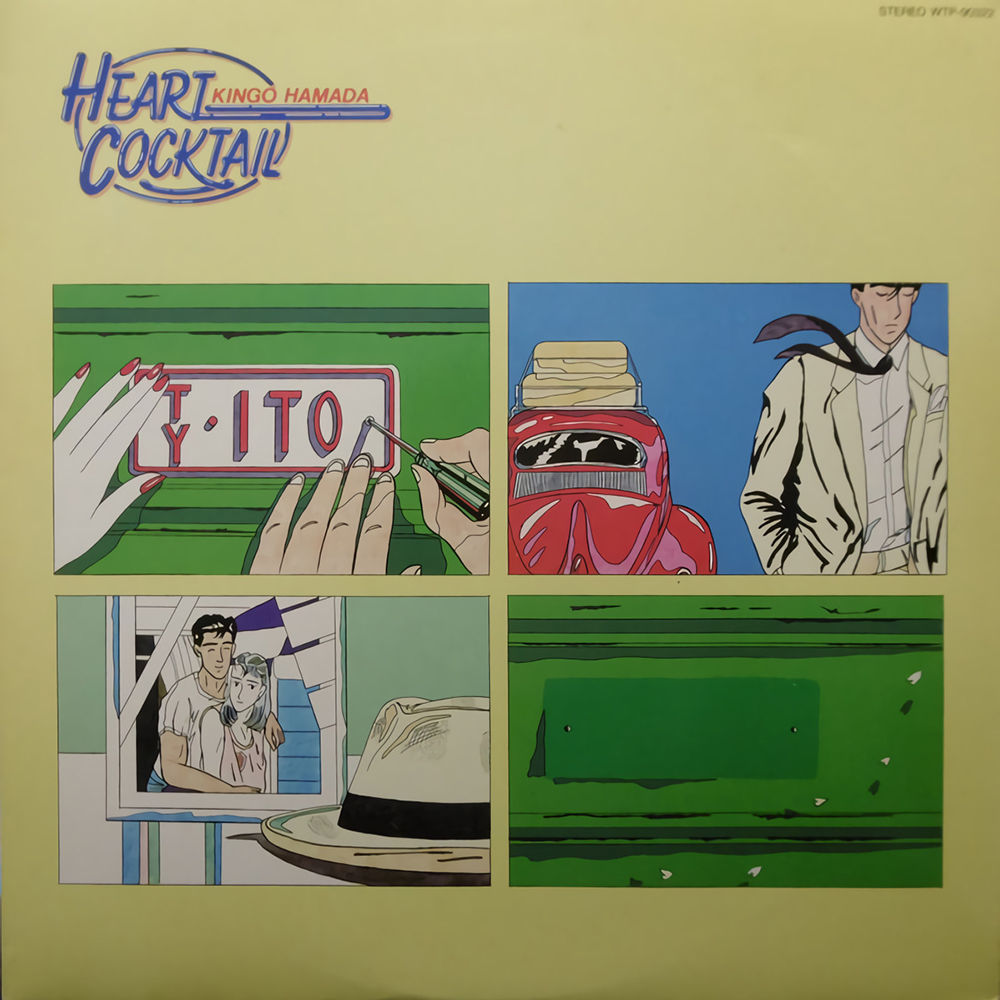
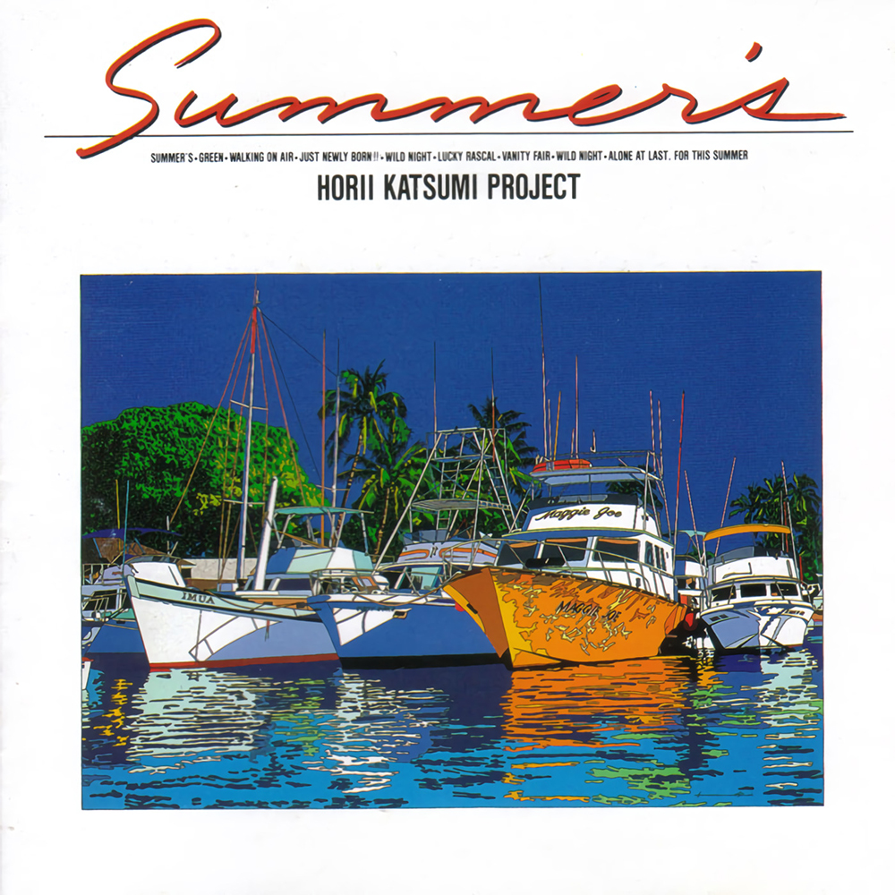

---

> **都市流行**（英语：City Pop；日语：シティ・ポップ，shitī poppu），是一种流行音
> 乐，属于 J-pop 的分支，起源于 1970 年代后期的日本。它是日本国内受西方文化影响衍
> 伸出来的音乐风格，以贝斯、电吉他与明显的节奏为人所知。它在日本经济泡沫时期（1980
> 年代）达到顶峰，主题多与与该国的经济繁荣有密切关系，侧面反映出该时期的城市夜晚、
> 都会风光。自 2010 年代以来，城市流行音乐在国际上获得了广泛关注，并成为蒸气波和未
> 来放克等加工音乐的基础。—— Wikipedia

---

{.alignfull}

---

若歌曲信息有误，欢迎联系我进行勘误。感谢！

つづく。

