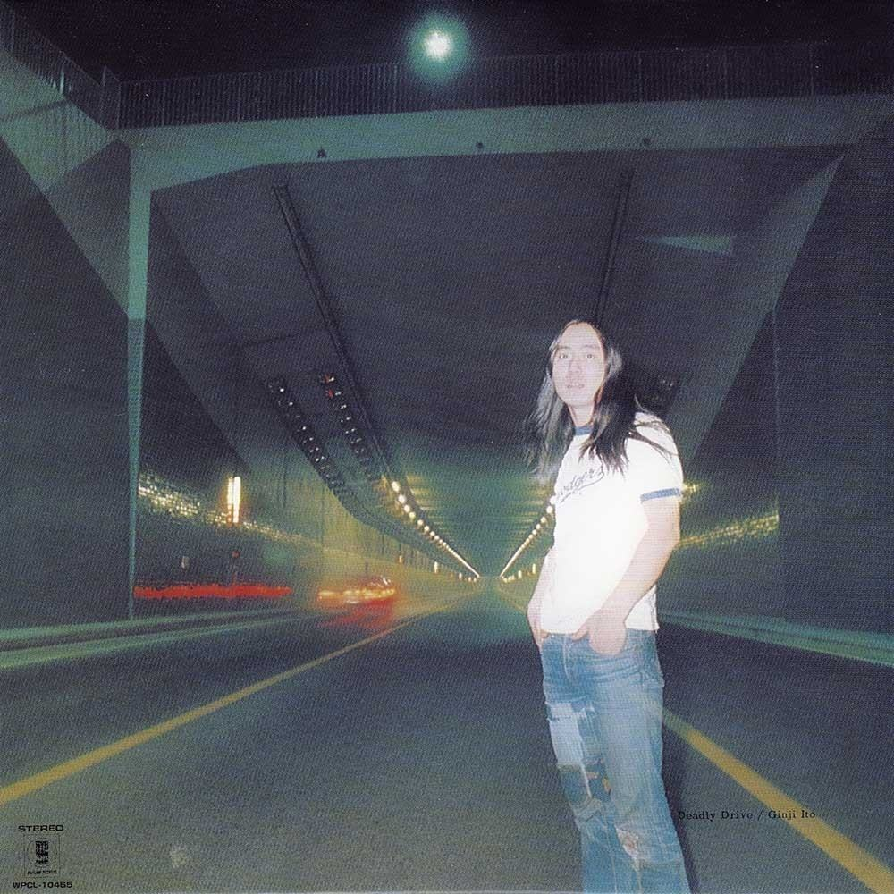
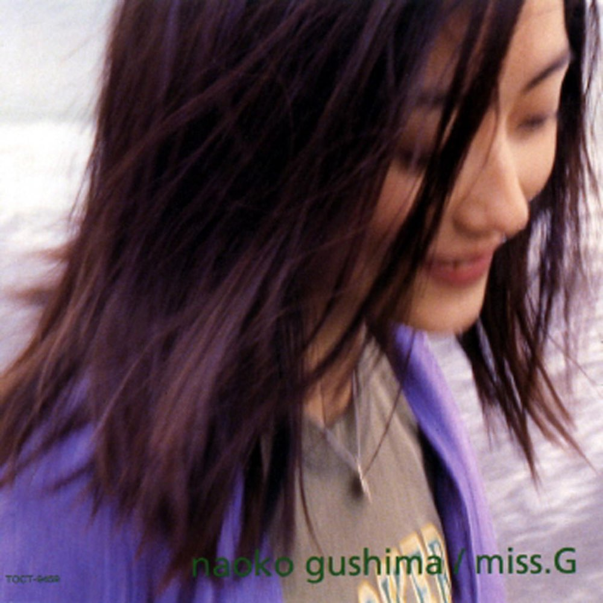
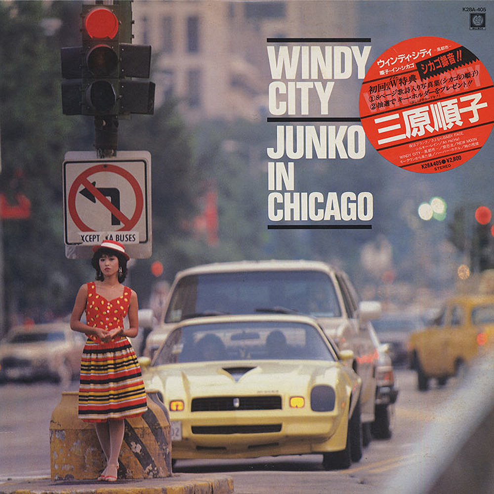
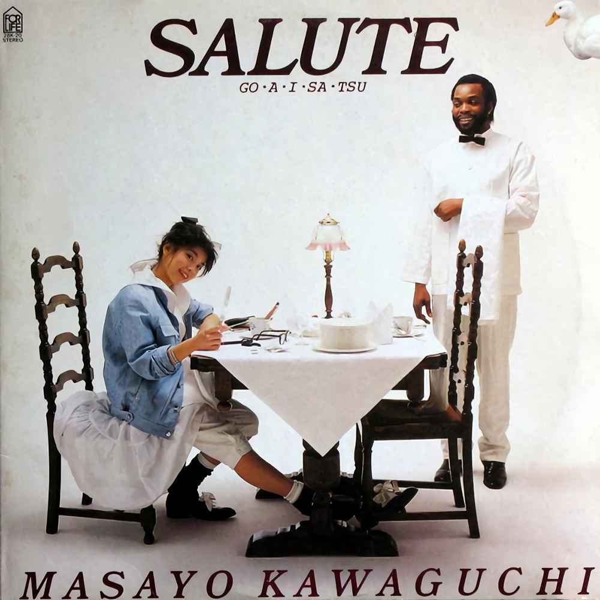

**都市流行**（英语：City Pop；日语：シティ・ポップ，shitī poppu），是一种流行音
乐，属于 J-pop 的分支，起源于 1970 年代后期的日本。它是日本国内受西方文化影响衍
伸出来的音乐风格，以贝斯、电吉他与明显的节奏为人所知。它在日本经济泡沫时期（1980
年代）达到顶峰，主题多与与该国的经济繁荣有密切关系，侧面反映出该时期的城市夜晚、
都会风光。都市流行音乐因其带有的日本泡沫经济时期的强烈色彩，吸引了一大批日本国内
乃至海外的忠实粉丝。自 2010 年代以来，随着竹内玛利亚等歌手的音乐在网络上的走红，
都市流行音乐开始复苏，并成为蒸气波和未来放克等加工音乐的基础，在全球范围内获得了
广泛关注，同时也引发出更多优秀的新生代 City Pop 力量。

该页收录了一些典型名专名曲和一些少人耳闻的典型曲目。以此纪念停服的 City Pop 大本营
—— 虾米音乐。同步[歌单](https://music.163.com/#/playlist?id=5483718802)发布在网易云音乐。

---

{.alignfull}

---

歌曲信息封面等均自网络收录，若信息有误，欢迎联系我进行勘误。感谢！

つづく。
